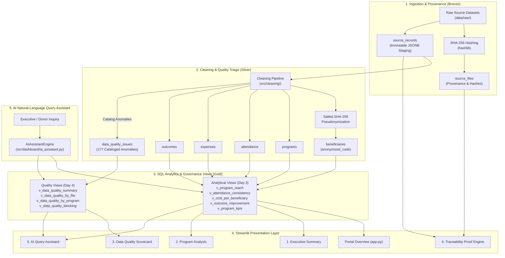

# TraceImpact — Traceable Impact Reporting & Data Quality Platform

TraceImpact is a data engineering, data quality observability, and impact reporting platform designed specifically for small-to-medium nonprofit organizations and philanthropic grant-makers. It transforms fragmented, messy operational spreadsheets into an audited PostgreSQL database, computes reliable social and financial KPIs via pre-aggregated SQL views, catalogs data quality anomalies without silently dropping records, and delivers a modern multi-page Streamlit dashboard featuring cryptographic 1-to-1 drilldown lineage and a safe AI natural-language query assistant.

---

## Problem

Nonprofit organizations and philanthropic foundations manage millions of dollars in grant capital using disconnected spreadsheets, attendance registers, and paper survey logs. Traditional reporting pipelines fail basic audit standards because:
1. **Silent Data Deletion:** Cleaning scripts routinely discard dirty rows (invalid dates, missing values, duplicates) to make graphs look clean, concealing data loss from auditors.
2. **Severed Lineage:** Aggregation pipelines sever links between aggregate dashboard numbers (e.g., *"42 beneficiaries served"*) and the source files, making it impossible to prove numbers were not fabricated.
3. **Metric Distortion:** Relational queries joining 1-to-many fact tables cause Cartesian row multiplication, inflating reported expenditures and attendance counts.
4. **Beneficiary Vulnerability:** Sharing raw operational sheets exposes sensitive Personally Identifiable Information (PII) of vulnerable community members.

---

## Solution

TraceImpact solves these challenges through an auditable, Medallion-style architecture that enforces data immutability, rigorous governance, and provable lineage:
- **Verbatim Ingestion:** Incoming CSV files are fingerprinted with SHA-256 hashes and staged verbatim as immutable JSONB records. Raw files on disk remain 100% untouched.
- **Defensible Observability:** Data quality defects are cataloged into an auditable issue log with severity and status, rather than being deleted.
- **PII Protection:** Community members' identities are protected via salted SHA-256 pseudonymization (`anonymized_code`).
- **Mathematically Sound Analytics:** PostgreSQL views utilize pre-aggregated Common Table Expressions (CTEs) and safe division (`NULLIF`) to eliminate row multiplication and division-by-zero errors.
- **Cryptographic Traceability:** Any dashboard metric or domain record can be traced back through foreign keys to the raw JSONB staging record, the parent file's SHA-256 hash, and the exact physical CSV row on disk.
- **Safe AI Natural-Language Querying:** Non-technical leaders can query the platform in plain English, with intent mapped strictly to approved read-only analytical views.

---

## Key Features

- **Immutable Raw-Data Ingestion:** Ingests operational spreadsheets with zero modification.
- **SHA-256 File Integrity:** Cryptographic hashing detects any accidental alteration or tampering with source datasets.
- **JSONB Raw Staging:** Stores raw rows verbatim with 1-based physical line coordinates.
- **Automated Data Cleaning:** Normalizes multi-format dates, currency symbols, casing, and whitespace.
- **Entity Resolution:** Maps messy program title variants (e.g. *"Digi-Literacy"*) to canonical master program IDs.
- **PII Pseudonymization:** Salts and hashes beneficiary identifiers to maintain donor auditability while guaranteeing privacy.
- **PostgreSQL Relational Model:** Normalized 8-table relational schema with foreign key integrity.
- **SQL Analytics & KPI Layer:** 6 analytical views calculating reach, consistency, unit economics, and outcome improvements.
- **Data Quality Scorecard:** 5 governance views tracking anomaly distributions, clean record rates, and resolution progress.
- **Multi-Page Streamlit Dashboard:** Executive overview, individual program deep-dives, and interactive triage workspace.
- **Program Analysis & Variance Tracking:** Automatically detects operational and financial variances (e.g. over-budget initiatives).
- **Issue Triage Lifecycle:** Programmatic workflow tracking issues from `OPEN` to `RESOLVED` or `ACCEPTED`.
- **1-to-1 End-to-End Traceability:** Complete click-through audit trail connecting high-level metrics to physical disk rows.
- **Raw JSONB Inspection:** Direct interactive inspection of staged source records (`st.json`).
- **Physical CSV Row Verification:** Live read-only file access confirming disk content matches database staging byte-for-byte.
- **AI Natural-Language Query Assistant:** Grounded Q&A engine with zero SQL hallucination risk and plain-English architectural explanations.

---

## Architecture



---

## Tech Stack

- **Python 3.14+:** Primary programming language for ingestion, cleaning, triage, and UI.
- **PostgreSQL 16+:** Relational database management system with JSONB semi-structured storage.
- **SQLAlchemy 2.0 & Psycopg2:** Object-Relational Mapping (ORM) and thread-safe connection pooling.
- **Pandas 2.2+:** Tabular data processing and pipeline transformations.
- **Streamlit 1.64+:** Interactive multi-page web application.
- **Plotly & Altair:** Executive data visualizations and statistical distributions.
- **Python-Dotenv:** Secure environment variable management.
- **Pytest 9.1+:** Automated unit, regression, and integration testing framework.
- **Faker:** Realistic synthetic operational data generation.
- **Git:** Version control and milestone management.

---

## Database Design

The PostgreSQL database enforces an 8-table relational model split into **Lineage & Audit Metadata** and **Normalized Core Domain Entities**:

### A. Lineage & Audit Metadata
1. **`source_files`**: Tracks every ingested CSV/Excel file, recording filename, ingestion timestamp, and SHA-256 cryptographic hash.
2. **`source_records`**: Immutable raw staging table storing verbatim rows as `JSONB`, linked to `source_files(file_id)` and original 1-based `row_index`.
3. **`data_quality_issues`**: Audit log recording anomalies (`issue_type`, `severity`, `raw_value`, `description`, `status`). All dirty data is cataloged rather than deleted.

### B. Normalized Domain Entities
4. **`programs`**: Master initiative entity storing program codes, official names, target categories, and allocated budgets.
5. **`beneficiaries`**: Community members served; contains demographic attributes and salted SHA-256 `anonymized_code` for PII protection.
6. **`attendance`**: Fact table recording individual session attendances, linking beneficiaries to programs with session hours.
7. **`expenses`**: Fact table tracking operational expenditures, categories, amounts, and receipt verification status.
8. **`outcomes`**: Fact table evaluating pre- and post-intervention survey scores and indicator improvements.

---

## Analytics (SQL View Layer)

TraceImpact deploys 6 production analytical views (`sql/views.sql`):
1. **`v_program_reach`**: Measures community breadth (distinct beneficiaries served, total attendance records, cumulative contact hours).
2. **`v_attendance_consistency`**: Evaluates participant engagement depth (sessions per person, average session duration).
3. **`v_cost_per_beneficiary`**: Evaluates financial efficiency (allocated budget, total expenditures, budget utilization %, and cost per unique beneficiary).
4. **`v_cost_per_beneficiary_hour`**: Measures capital efficiency per contact hour delivered.
5. **`v_outcome_improvement`**: Quantifies social impact (average baseline score, average exit score, point improvement, and relative percentage gain).
6. **`v_program_kpis`**: Consolidated 16-metric master scorecard uniting reach, attendance, economics, and outcomes into a single non-duplicated view.

---

## Data Quality (Scorecard Views)

TraceImpact deploys 5 data quality governance views (`sql/views_quality.sql`):
1. **`v_data_quality_summary`**: High-level platform health (total anomalies, clean record rate %, resolution rate %, severity breakdown).
2. **`v_data_quality_by_file`**: Anomaly counts and severity proportions grouped by source file.
3. **`v_data_quality_by_program`**: Anomaly counts grouped by program, explicitly preserving unassigned organization-level items.
4. **`v_data_quality_by_type`**: Anomaly distribution across standardized error types (`MISSING_VALUE`, `INVALID_FORMAT`, `DUPLICATE`, `INVALID_NUMBER`, `UNMATCHED_REFERENCE`).
5. **`v_data_quality_blocking`**: Quarantined critical `ERROR` records that must not contaminate downstream financial or outcome reports.

---

## Dashboard (5 Interactive Pages)

1. **Portal Overview (`app.py`):** Real-time PostgreSQL health probe, platform volume counters, and architectural navigation cards.
2. **Executive Summary (`pages/1_Executive_Summary.py`):** 8 high-level KPI cards and 5 visual analytics charts.
3. **Program Analysis (`pages/2_Program_Analysis.py`):** Dynamic program selector, 12-metric scorecard, budget utilization monitor, and 4-domain tabbed explorer.
4. **Data Quality Scorecard (`pages/3_Data_Quality.py`):** Observability distributions, blocking quarantine review, and multi-filter interactive triage table.
5. **Traceability Proof Engine (`pages/4_Traceability.py`):** 1-to-1 drilldown proof engine connecting metrics to raw JSONB and physical CSV disk rows.
6. **AI Query Assistant (`pages/5_AI_Query_Assistant.py`):** Natural language Q&A and SQL explainer grounded in PostgreSQL views.

---

## Traceability (The Proof Engine)

TraceImpact enables complete, bi-directional verification from any dashboard KPI to the physical CSV file:

```
Dashboard KPI / Report
        ↓
PostgreSQL Analytical View (v_program_reach, v_program_kpis)
        ↓
Domain Table Row (attendance, expenses, beneficiaries, outcomes)
        ↓ [Foreign Key: source_record_id]
Raw Staging Table (source_records)
        ↓ [Verbatim raw_data JSONB + 1-based row_index]
File Provenance Table (source_files)
        ↓ [SHA-256 cryptographic fingerprint]
Physical Raw CSV on Local Disk (data/raw/<filename>)
        [Exact row index read-only verification]
```

### Concrete Verified Lineage Examples:
- **Beneficiaries:** `BEN-001` ➔ `source_record_id: 619` ➔ `source_records.record_id: 619` ➔ `beneficiaries.csv` (Row 1)
- **Attendance:** `ATT-0001` ➔ `source_record_id: 1` ➔ `source_records.record_id: 1` ➔ `attendance.csv` (Row 1)
- **Expenses:** `EXP-0001` ➔ `source_record_id: 671` ➔ `source_records.record_id: 671` ➔ `expenses.csv` (Row 1)
- **Outcomes:** `SURV-0001` ➔ `source_record_id: 740` ➔ `source_records.record_id: 740` ➔ `outcomes.csv` (Row 1)
- **Quarantined Defect:** `issue_id: 352` ➔ `record_id: 765` ➔ `source_records.record_id: 765` ➔ `outcomes.csv` (Row 26)

---

## Data Quality Metrics (Verified Baseline)

- **Total Cataloged Issues:** 177
- **Severity Breakdown:**
  - `ERROR`: 10 (5.65%) — Quarantined blocking defects
  - `WARNING`: 12 (6.78%) — Completeness warnings
  - `INFO`: 155 (87.57%) — Automated formatting/normalization actions
- **Issue Status Breakdown:**
  - `OPEN`: 28 (15.82%)
  - `RESOLVED`: 149 (84.18%)
  - `ACCEPTED`: 0 (0.00%)
- **Data Reliability Index (DRI):** **94.94 / 100**
- **Clean Record Rate:** **98.72%**
- **Issue Resolution Rate:** **84.18%**

---

## Example Insights (Synthetic Dataset Findings)

The included synthetic dataset models real-world operational challenges:
- **Total Portfolio Reach:** 5 programs served **51 unique community members** across **612 verified session attendances** and **1,114.50 cumulative contact hours**.
- **Financial Footprint:** Total expenditures of **₹666,950.36** across 67 verified expense transactions.
- **Over-Budget Discovery:** **Community Nutrition Drive (`PRG-005`)** is operating over budget at **156.75% budget utilization** (Spent: ₹148,913.20 vs. Allocated Budget: ₹95,000.00).
- **Cost Efficiency Leader:** **Elderly Healthcare Outreach (`PRG-004`)** achieved the lowest cost per person at **₹2,044.94**, while **Women Vocational Sewing (`PRG-002`)** had the highest unit cost at **₹4,346.91**.
- **Social Impact Leader:** **Youth Coding Bootcamp (`PRG-003`)** generated the highest score gains, with an average outcome improvement of **+31.40 points** (Baseline: 34.60 ➔ Exit: 66.00, an 89.28% relative gain).

---

## How To Run

### 1. Clone & Set Up Virtual Environment
```bash
git clone <repo-url>
cd project1

# Create and activate virtual environment
python3 -m venv .venv
source .venv/bin/activate

# Install dependencies
pip install -r requirements.txt
```

### 2. Configure PostgreSQL Connection
Create a `.env` file based on `.env.example`:
```bash
cp .env.example .env
```
Ensure your PostgreSQL instance is running and update credentials in `.env`:
```ini
DB_HOST=localhost
DB_PORT=5432
DB_NAME=traceimpact
DB_USER=your_postgres_user
DB_PASSWORD=your_postgres_password
SALT_KEY=traceimpact_super_secret_pii_salt_2026
```

### 3. Run Automated Ingestion & Cleaning Pipeline
```bash
# Apply database DDL schema
.venv/bin/python src/database/apply_views.py

# Ingest raw CSV files into JSONB staging
.venv/bin/python src/ingestion/ingest_raw.py

# Execute cleaning pipeline and load domain tables
.venv/bin/python src/cleaning/run_pipeline.py
```

### 4. Execute Full Automated Test Suite
```bash
.venv/bin/python -m pytest -v
```
*(Expected output: 81/81 tests passing across Days 1–7 and World Bank API suite in < 1.5s).*

### 5. Ingest Real Public Data (TraceImpact 2.0 Extension)
```bash
# Ingest curated World Bank development indicators (2018-2021)
.venv/bin/python -m src.ingestion.world_bank --start-year 2018 --end-year 2021
```

### 6. Launch the Streamlit Dashboard
```bash
.venv/bin/python -m streamlit run app.py
```
Open your browser at `http://localhost:8501`.

---

## Real Public Data Pipeline (TraceImpact 2.0)

TraceImpact 2.0 extends the platform beyond controlled internal operational datasets by introducing a scalable ingestion pipeline for real-world public data:

```
        ┌───────────────────────────────────────────────────────────┐
        │                     DATA SOURCES                          │
        ├─────────────────────────────┬─────────────────────────────┤
        │  Controlled Synthetic CSVs  │   Real Public REST API      │
        │  (Nonprofit Operations)     │   (World Bank Indicators)   │
        └──────────────┬──────────────┴──────────────┬──────────────┘
                       │                             │
                       └──────────────┬──────────────┘
                                      ↓
                               INGESTION LAYER
                                      ↓
                               RAW / BRONZE
                     (source_records & api_raw_responses)
                                      ↓
                               VALIDATION & DQ
                                      ↓
                               CLEAN / SILVER
                    (PostgreSQL Relational Domain Tables)
                                      ↓
                               ANALYTICAL / GOLD
                          (PostgreSQL SQL Views)
                                      ↓
                             STREAMLIT DASHBOARD
                        (Pages 1–5 & Public Explorer)
                                      ↓
                            TRACEABILITY & LINEAGE
```

- **Data Provider:** World Bank Indicators API (`api.worldbank.org/v2`).
- **Domain Separation:** Maintained in separate schema tables (`world_bank_countries`, `world_bank_indicators`, `world_bank_observations`, `world_bank_data_quality_issues`, `world_bank_anomalies`, `ai_investigations`, `ai_insights`) to guarantee zero mixing with synthetic nonprofit impact data.
- **Automated Scheduling:** Configurable daily background scheduler (`src/ingestion/scheduler.py`).
- **Bronze Layer Immutability:** Full JSON responses stored verbatim in `api_raw_responses` with SHA-256 hash digests.
- **Silver Layer Normalization:** Idempotent country and observation loading with range, format, and null checks.
- **Gold Layer Views:** Multi-year trend analytics (`v_world_bank_country_trends`), latest indicator rankings (`v_world_bank_latest_indicators`), descriptive statistics (`v_world_bank_indicator_summary`), and unified AI lineage (`v_world_bank_ai_lineage`).
- **Machine Learning Anomaly Detection:** Scikit-learn `IsolationForest` detecting statistical outliers (Z-scores, YoY growth breakouts) without ungrounded causal claims.
- **AI Investigation & Grounded Insights:** Formulates structured quantitative evidence, historical baselines, and contextual hypotheses with mandatory non-causality notices.
- **Interactive Exploration:** Accessible via **Page 6: Public Data Explorer** with interactive anomaly investigation and 1-to-1 API lineage drilldown.

### TraceImpact 2.0 CLI Commands

```bash
# Ingest World Bank indicators manually (idempotent upserts)
python -m src.ingestion.world_bank --start-year 2018 --end-year 2025

# Run the automated background scheduler
python -m src.ingestion.scheduler --once

# Train or execute ML Isolation Forest anomaly detection
python -m src.ml.anomaly_detector

# Generate automated AI investigations and grounded insights
python -m src.ai.investigator
```

---

## Documentation Index

- [`docs/ARCHITECTURE.md`](file:///Users/shashwat/Desktop/project1/docs/ARCHITECTURE.md): Complete system architecture, Medallion flow, and security specifications.
- [`docs/REAL_DATA_INGESTION.md`](file:///Users/shashwat/Desktop/project1/docs/REAL_DATA_INGESTION.md): TraceImpact 2.0 World Bank public data pipeline architecture.
- [`docs/AUTOMATION.md`](file:///Users/shashwat/Desktop/project1/docs/AUTOMATION.md): Automated scheduler configuration and cron execution guide.
- [`docs/ML_ANOMALY_DETECTION.md`](file:///Users/shashwat/Desktop/project1/docs/ML_ANOMALY_DETECTION.md): Machine learning anomaly detection methodology and non-causality boundaries.
- [`docs/AI_DATA_INTELLIGENCE.md`](file:///Users/shashwat/Desktop/project1/docs/AI_DATA_INTELLIGENCE.md): Grounded AI investigation engine and SQL security constraints.
- [`docs/DEMO_SCRIPT.md`](file:///Users/shashwat/Desktop/project1/docs/DEMO_SCRIPT.md): 3-minute executive presentation walkthrough script.
- [`docs/DEMO_WALKTHROUGH.md`](file:///Users/shashwat/Desktop/project1/docs/DEMO_WALKTHROUGH.md): Complete visual evaluation and spoken script walkthrough.
- [`docs/DAY_1_6_FINAL_BASELINE.md`](file:///Users/shashwat/Desktop/project1/docs/DAY_1_6_FINAL_BASELINE.md): Verified Day 1–6 project baseline.
- [`docs/POST_DAY_5_6_REVIEW.md`](file:///Users/shashwat/Desktop/project1/docs/POST_DAY_5_6_REVIEW.md): Independent deep-inspection review report.
- [`docs/DATA_PIPELINE.md`](file:///Users/shashwat/Desktop/project1/docs/DATA_PIPELINE.md): Data cleaning rules and normalization contracts.
- [`docs/KPI_DEFINITIONS.md`](file:///Users/shashwat/Desktop/project1/docs/KPI_DEFINITIONS.md): Nonprofit KPI formulas and lineage catalog.
- [`docs/DATA_QUALITY_SCORECARD.md`](file:///Users/shashwat/Desktop/project1/docs/DATA_QUALITY_SCORECARD.md): Quality scorecard views and reliability scoring methodology.
- [`docs/DASHBOARD.md`](file:///Users/shashwat/Desktop/project1/docs/DASHBOARD.md): Streamlit application architecture and user guide.
- [`docs/TRACEABILITY.md`](file:///Users/shashwat/Desktop/project1/docs/TRACEABILITY.md): 1-to-1 cryptographic lineage proof specifications.

