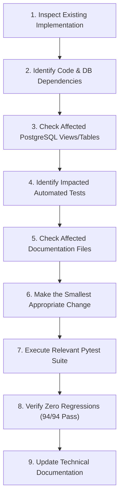

# TraceImpact 2.0 — AI Coding Agent Guidelines & Operating Manual

> **Document Version:** 2.0.0  
> **Audience:** Future AI Coding Agents, Autonomous Pair Programmers, and Software Engineers.  
> **Mission:** Maintain, extend, debug, and validate the TraceImpact codebase while strictly preserving architectural integrity, data provenance, and security boundaries.

---

## 1. What is TraceImpact?

**TraceImpact** is a defensible data engineering and intelligence platform combining:
1. **Synthetic Nonprofit Operations:** Deterministic CSV ingestion, cleaning, validation, PII pseudonymization, and KPI reporting.
2. **Real World Bank Public Data:** Live REST API ingestion, pagination, schema validation, and time-series normalization.
3. **Unsupervised ML Anomaly Detection:** Isolation Forest model scoring deviations across multi-year indicator trajectories.
4. **Grounded AI Investigations:** Evidence-backed investigation reports strictly segregating empirical facts from non-causal hypotheses.
5. **1-to-1 Cryptographic Lineage:** Unbroken SHA-256 and foreign-key tracking from dashboard metrics to raw byte payloads.
6. **Multi-Interface Presentation:** Streamlit technical control center + Power BI executive reporting layer.

---

## 2. Repository Structure & Key Directory Map

```
/Users/shashwat/Desktop/project1/
├── app.py                      # Streamlit main entrypoint & health check
├── requirements.txt            # Python dependencies (exact versions)
├── pytest.ini                  # Pytest configuration
├── .env.example                # Template for environment variables (NO SECRETS)
├── data/
│   ├── raw/                    # IMMUTABLE original CSV spreadsheets (DO NOT EDIT)
│   └── processed/              # Cleaned CSV export artifacts
├── demo/                       # Live Pipeline Visualizer demo application
├── docs/                       # Comprehensive architectural & technical documentation
├── models/                     # Serialized ML model weights (.joblib)
├── pages/                      # Streamlit multi-page dashboard views (1 to 6)
├── power_bi/                   # Power BI M scripts, DAX library, theme, data extracts
├── sql/                        # PostgreSQL schema definitions and analytical views
│   ├── schema.sql              # Core synthetic domain tables & staging
│   ├── schema_world_bank.sql   # World Bank public data tables
│   ├── schema_ml_intelligence.sql # ML models, anomalies, AI investigations
│   ├── views.sql               # Core nonprofit analytical views (v_program_*)
│   ├── views_quality.sql       # Data quality summary and triage views
│   ├── views_world_bank.sql    # Public data trend and regional comparison views
│   └── views_power_bi.sql      # Dedicated Power BI presentation views (v_pbi_*)
├── src/                        # Modular Python source code
│   ├── config.py               # Centralized configuration & environment loader
│   ├── ai/                     # Grounded AI investigation engine (investigator.py)
│   ├── cleaning/               # Declarative transformers, normalizers, validators
│   ├── dashboard/              # Query layer, AI assistant, formatting utilities
│   ├── database/               # Database engine, connection pooling, session helpers
│   ├── ingestion/              # HTTP client, scheduler, World Bank pipeline
│   ├── ml/                     # Feature extractor, Isolation Forest anomaly detector
│   ├── power_bi_export.py      # Power BI CSV and schema exporter
│   ├── power_bi_validator.py   # Automated Power BI measure validator
│   └── quality/                # Issue triage, World Bank quality validators
└── tests/                      # Automated test suite (94 tests + 100K stress harness)
```

---

## 3. Strict Operating Invariants (The "NEVER" Rules)

Agents working on this repository MUST strictly follow these rules:

1. **NEVER invent database columns or tables**: Every SQL statement must reference verified tables/views present in `sql/` and active in PostgreSQL.
2. **NEVER invent or fabricate API responses**: All test mocks and API schemas must mirror the actual World Bank API response structure.
3. **NEVER fabricate test results**: Never report that tests passed without executing `.venv/bin/python -m pytest` and inspecting output.
4. **NEVER claim a feature is implemented without verifying it in code**: If a feature is planned or proposed, explicitly label it `Status: PLANNED`.
5. **NEVER commit or hardcode credentials**: Database passwords, secret keys, and tokens must always be loaded via `src/config.py` from `.env`.
6. **NEVER bypass data quality or security controls**: Never weaken validators or bypass read-only SQL checks just to force a query to work.
7. **NEVER modify files in `data/raw/`**: Raw CSV files on disk are immutable bronze artifacts; modifications destroy cryptographic provenance.
8. **NEVER make causal claims in ML or AI modules**: Anomaly scores reflect statistical divergence, not real-world causation.

---

## 4. Before Changing Code (9-Step Protocol)

When given a development or debugging task, follow this exact sequence:



1. **Inspect Existing Implementation**: Read the actual code files involved using `view_file` before planning changes.
2. **Identify Dependencies**: Trace function calls, imported modules, and database queries.
3. **Identify Affected Tables & Views**: Check if table schemas, view definitions, or column names are modified.
4. **Identify Affected Tests**: Find corresponding tests in `tests/test_day*.py`, `test_ml_and_ai.py`, or `test_world_bank.py`.
5. **Identify Affected Documentation**: Determine if `ARCHITECTURE.md`, `FLOW.md`, `DECISIONS.md`, or `PRD.md` need updates.
6. **Make Smallest Appropriate Edit**: Avoid unnecessary rewrites or architectural refactoring.
7. **Run Tests**: Execute `.venv/bin/python -m pytest tests/` to verify correctness.
8. **Verify Zero Regressions**: Confirm that all 94 unit/integration tests pass.
9. **Update Documentation**: Ensure documentation accurately reflects updated behavior.

---

## 5. Coding & Engineering Conventions

### Python Conventions
- Use **Python 3.10+** type annotations (`typing.Dict`, `typing.List`, `typing.Optional`, `typing.Tuple`).
- Use standard docstrings explaining Purpose, Args, and Returns.
- Load environment configuration strictly through `src.config.Config` or `src.database.db.get_db_connection()`.
- Handle exceptions gracefully with specific exception types; never use bare `except: pass`.

### SQL & Database Conventions
- All SQL queries in Python must use **parameterized SQLAlchemy binds** (e.g. `:country_code`, `:year`). Never format raw strings into SQL statements.
- Financial numbers must use SQL `NUMERIC(12, 2)` or `NUMERIC(14, 2)`.
- Ratios and divisions must always use `NULLIF(denominator, 0)` to prevent runtime division-by-zero crashes.
- Common Table Expressions (CTEs) must be used for pre-aggregations before joining across 1-to-many relationships to prevent Cartesian row duplication.
- View names must follow standard naming conventions:
  - `v_program_*`: Core nonprofit domain analytical views.
  - `v_data_quality_*`: Data quality summary and triage views.
  - `v_world_bank_*`: Public data trends and regional benchmarks.
  - `v_pbi_*`: Dedicated Power BI presentation views.

### ML & AI Conventions
- ML models must be versioned in `ml_anomaly_models` and saved to `models/` with semantic version tags.
- The feature extractor must handle missing values and divide-by-zero scenarios gracefully (using $\epsilon = 10^{-6}$).
- AI investigation prompts must strictly separate **FACTS** from **INTERPRETATION** and append the mandatory non-causality notice.

---

## 6. Standard Execution Commands for Agents

Always run commands inside the virtual environment (`.venv`):

```bash
# 1. Run Complete Automated Test Suite (94 Tests)
source .venv/bin/activate && python -m pytest tests/ -v

# 2. Run Specific Subsystem Test Suites
python -m pytest tests/test_day1.py tests/test_day2.py tests/test_day3.py  # Core ETL
python -m pytest tests/test_day4.py tests/test_day5.py tests/test_day6.py  # Quality & Lineage
python -m pytest tests/test_day7.py                                       # AI Query Assistant
python -m pytest tests/test_world_bank.py                                 # World Bank Pipeline
python -m pytest tests/test_ml_and_ai.py                                  # ML & AI Layer

# 3. Run Synthetic Data Ingestion & Cleaning Pipeline
python -m src.cleaning.run_pipeline

# 4. Run World Bank Ingestion (Single Pass / CI Mode)
python -m src.ingestion.scheduler --once

# 5. Run ML Anomaly Detection & Model Training
python -m src.ml.anomaly_detector

# 6. Run AI Investigation Engine
python -m src.ai.investigator

# 7. Run Power BI Measure Validator (100% SQL Parity Check)
python -m src.power_bi_validator

# 8. Export Power BI Schema, M Scripts, and CSV Extracts
python -m src.power_bi_export

# 9. Launch Streamlit Application
streamlit run app.py --server.port 8501
```

---

## 7. Git Workflow & Repository Hygiene

- **Untracked Sensitive Files**: Verify that `.env`, `.venv/`, `.pytest_cache/`, `__pycache__/`, and `.DS_Store` are never committed.
- **Commit Messages**: Use structured conventional commit messages (e.g., `feat:`, `fix:`, `docs:`, `test:`, `refactor:`).
- **Pre-Commit Verification**: Never commit changes if `pytest tests/` fails or if `git status` shows unintended modifications.
