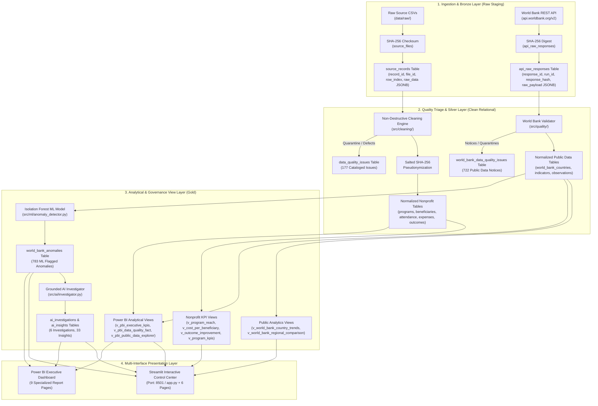

# TraceImpact 2.0 — System Architecture & Technical Specifications

> **Document Version:** 2.0.0  
> **Status:** RELEASE VALIDATED  
> **Milestone:** Complete Production-Oriented Portfolio Architecture (Synthetic Operations + Live Public Data + ML + AI + Power BI)

---

## 1. System Overview & Core Philosophy

**TraceImpact** is a portfolio-scale, defensible data engineering and intelligence platform designed for nonprofit operations, philanthropic impact verification, and public development analytics.

Traditional data stacks fail auditability standards because dirty data is discarded during ad-hoc transformations and dashboard metrics cannot be traced back to original spreadsheets or API payloads. TraceImpact enforces four inviolable architectural principles:
1. **Raw Data Immutability:** Source datasets and REST API payloads are ingested verbatim, hashed via SHA-256, and staged in PostgreSQL JSONB tables. Raw files on disk are never altered.
2. **Defensible Data Quality Triage:** Anomalies (duplicates, invalid numbers, missing values, orphan foreign keys) are cataloged into an auditable issue log with severity (`ERROR`, `WARNING`, `INFO`) and status (`OPEN`, `RESOLVED`, `QUARANTINED`), rather than being silently dropped.
3. **1-to-1 Cryptographic Lineage:** Every KPI, domain entity, and AI insight maintains an unbroken pointer (`source_record_id` / `response_hash`) connecting high-level reports back to the physical CSV row or raw API payload.
4. **Deterministic Evidence Grounding for AI & ML:** Machine learning anomaly scores are purely descriptive, and AI explanations are strictly bound to pre-calculated empirical database metrics with non-causality guarantees.

---

## 2. End-to-End Medallion Architecture Diagram

---

## 3. Detailed Component Architecture

### 3.1 Raw Ingestion & Bronze Staging Layer
- **Purpose**: Verbatim capture of incoming data files and REST API responses with cryptographic provenance.
- **Technology**: Python 3.10+ (`hashlib`, `requests`, `psycopg2`), PostgreSQL JSONB.
- **Inputs**: Raw CSV spreadsheets (`data/raw/*.csv`), World Bank REST API responses.
- **Outputs**: Staged records in `source_files`, `source_records`, `api_ingestion_runs`, `api_raw_responses`.
- **Dependencies**: PostgreSQL 14+, local filesystem.
- **Failure Modes**: Missing input files, network timeouts, HTTP 429 rate limits, malformed JSON.
- **Security Considerations**: File hashes verify data integrity; no cleartext credentials stored.
- **Traceability**: Calculates SHA-256 hash before reading file; records 1-based line coordinates.
- **Current Status**: ✅ IMPLEMENTED.

### 3.2 Cleaning, Normalization & PII Protection Layer (Silver)
- **Purpose**: Deterministic normalization of messy field data, PII pseudonymization, and domain constraint enforcement.
- **Technology**: Pandas, regular expressions, HMAC/SHA-256.
- **Inputs**: `source_records.raw_data` JSONB.
- **Outputs**: Cleaned CSV artifacts (`data/processed/*.csv`), normalized relational domain rows (`programs`, `beneficiaries`, `attendance`, `expenses`, `outcomes`).
- **Dependencies**: `source_records`, `source_files`.
- **Failure Modes**: Unmapped program aliases, invalid dates, negative expenses, duplicate participant IDs.
- **Security Considerations**: Community member full names and phone numbers are excluded from domain tables and replaced with salted SHA-256 `anonymized_code`.
- **Traceability**: Every domain record carries a foreign key `source_record_id` pointing to `source_records.record_id`.
- **Current Status**: ✅ IMPLEMENTED.

### 3.3 Data Quality & Observability Triage Engine
- **Purpose**: Systematically catalog and categorize every data anomaly rather than dropping records.
- **Technology**: Python rule engine, PostgreSQL relational tables.
- **Inputs**: Raw records and candidate cleaned objects.
- **Outputs**: Cataloged issues in `data_quality_issues` and `world_bank_data_quality_issues`.
- **Severities**:
  - `ERROR`: Blocking defects quarantined from domain tables (10 synthetic errors).
  - `WARNING`: Non-blocking defects with missing optional data (12 synthetic warnings).
  - `INFO`: Formatting notices and API missing values (155 synthetic + 722 World Bank notices).
- **Current Status**: ✅ IMPLEMENTED.

### 3.4 Analytical Views & Gold Layer
- **Purpose**: Centralize KPI calculations, eliminate Cartesian row multiplication, and enforce division safety.
- **Technology**: PostgreSQL SQL Views utilizing Common Table Expressions (CTEs), `NULLIF()`, and window functions (`LAG()`).
- **Key Views**:
  - `v_program_reach`: Unique participants and attendance session hours per program.
  - `v_cost_per_beneficiary`: Program financial efficiency.
  - `v_outcome_improvement`: Baseline vs exit survey scores and percentage improvement.
  - `v_program_kpis`: Master 16-metric rollup per program.
  - `v_world_bank_country_trends`: Multi-year time-series with YoY growth %.
  - `v_pbi_*`: 9 dedicated views optimized for Power BI import and DirectQuery.
- **Current Status**: ✅ IMPLEMENTED.

### 3.5 Machine Learning Anomaly Detection Layer
- **Purpose**: Detect multivariate statistical divergence in country-year development indicators.
- **Technology**: Python (`scikit-learn`), `IsolationForest`, `joblib`.
- **Features (4-Dimensional Vector)**:
  1. `z_score`: Standard deviations from country historical trajectory.
  2. `yoy_growth_pct`: Year-over-Year percentage change.
  3. `peer_z_score`: Deviation relative to global peer group in the same reporting year.
  4. `hist_ratio`: Ratio against country historical mean.
- **Outputs**: Model registry in `ml_anomaly_models`, serialized weights in `models/`, scored rows in `world_bank_anomalies`.
- **Non-Causality Boundary**: Detects empirical statistical divergence without claiming real-world causation.
- **Current Status**: ✅ IMPLEMENTED.

### 3.6 Grounded AI Investigation Layer
- **Purpose**: Synthesize complex anomalous multi-indicator patterns into actionable executive briefings.
- **Technology**: Python (`src/ai/investigator.py`), PostgreSQL JSONB, LLM integration or grounded rule-based engine.
- **Inputs**: Anomalies from `world_bank_anomalies` + pre-calculated historical baselines.
- **Outputs**: Structured investigations in `ai_investigations`, actionable bulletins in `ai_insights`.
- **Grounding Invariant**: Strictly separates **VERIFIED FACTS** from **CONTEXTUAL HYPOTHESES** and appends mandatory non-causality notices.
- **Current Status**: ✅ IMPLEMENTED.

### 3.7 AI Query Assistant & Security Layer
- **Purpose**: Natural-language to SQL translation for non-technical users.
- **Technology**: Python (`src/dashboard/ai_assistant.py`), SQL parser.
- **Security Invariant**: Read-only token enforcement (strictly `SELECT` and `WITH`), blocklist of DDL/DML keywords, anti-chaining filter, and approved Gold view whitelist.
- **Current Status**: ✅ IMPLEMENTED.

### 3.8 Presentation Layer (Streamlit + Power BI)
- **Streamlit (`http://localhost:8501`)**: Technical/operational control plane with 6 pages (`app.py`, `1_Executive_Summary.py`, `2_Program_Analysis.py`, `3_Data_Quality.py`, `4_Traceability.py`, `5_AI_Query_Assistant.py`, `6_Public_Data_Explorer.py`).
- **Power BI Desktop & Web**: Executive reporting layer with 9 pages, 32 DAX measures, M scripts, high-contrast dark theme, and 100% verified PostgreSQL data parity.
- **Current Status**: ✅ IMPLEMENTED.

---

## 4. Current vs Proposed Future Cloud Architecture

| Architectural Dimension | Current Implementation (TraceImpact 2.0) | Proposed Future Cloud Architecture |
| :--- | :--- | :--- |
| **Hosting & Infrastructure** | Localhost / Single-Node Server | Cloud Virtual Network (AWS VPC / Azure VNet) |
| **Database Engine** | Local PostgreSQL 14+ Instance | Managed Cloud DB (Azure Database for PostgreSQL / AWS RDS) |
| **Raw Bronze Storage** | Local Disk (`data/raw/`) + Database JSONB | Cloud Object Store (Azure Blob / ADLS Gen2 / AWS S3) |
| **Pipeline Orchestration** | Pure-Python Background Scheduler | Cloud Orchestrator (Azure Data Factory / AWS Step Functions) |
| **Machine Learning** | Local Scikit-Learn Isolation Forest | Managed ML Endpoint (Azure ML / AWS SageMaker / Vertex AI) |
| **AI Investigation** | Local Grounded Engine + API client | Managed LLM API (Azure OpenAI / Google Vertex AI Gemini) |
| **BI Presentation** | Local Streamlit + Power BI Desktop / Web | Hosted Streamlit in Container + Power BI Service Workspace |
| **Monitoring & Logs** | PostgreSQL Audit Tables + Python Logging | Cloud Telemetry (Azure Monitor / AWS CloudWatch / Datadog) |

---

## 5. Security, Observability & Performance Metrics

1. **Security**:
   - Zero hardcoded passwords; environment-driven configuration via `.env` and `src/config.py`.
   - 100% parameterized SQLAlchemy queries eliminating SQL injection.
   - PII pseudonymized via salted SHA-256 before reaching domain tables.
2. **Observability**:
   - Every ingestion run recorded in `api_ingestion_runs` with start/end timestamps, records inserted/quarantined, and error messages.
   - Every quality defect cataloged in `data_quality_issues` with column name, raw value, and severity.
3. **Empirical Performance Profile**:
   - **Sub-15ms Query Latency**: Indexed Gold views respond in <15ms on local PostgreSQL.
   - **Sub-Second ML Execution**: Isolation Forest fits 5,588 records in 0.24s; inference executes in 0.13s.
   - **High-Volume Throughput**: 100,000-record stress test processed in 5.23s (19,120 RPS) with peak memory under 417 MB.
   - **Rapid Test Suite**: Complete 94-test regression suite executes in ~2.0s.
