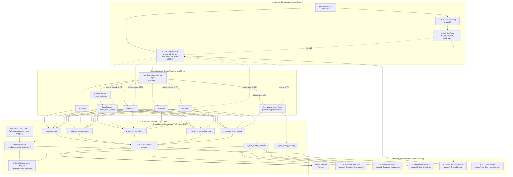

# TraceImpact — System Architecture & Technical Specifications

**Document Version:** 1.0.0  
**Status:** Production Ready  
**Milestone:** Complete Day 1–7 Portfolio Architecture  

---

## 1. Executive Summary & Architectural Philosophy

**TraceImpact** is an enterprise-grade data platform engineered for nonprofit organizations and philanthropic grant-makers. Traditional data stacks in the social sector frequently fail auditability standards because dirty data is discarded during ad-hoc transformations, and dashboard metrics cannot be traced back to original spreadsheets.

TraceImpact enforces three inviolable architectural principles:
1. **Raw Data Immutability:** Source datasets are ingested verbatim, hashed via SHA-256, and stored in JSONB staging. Raw files on disk are never altered.
2. **Defensible Data Governance:** Anomalies (duplicates, invalid numbers, missing fields) are cataloged into an auditable issue log with severity and status, rather than being silently dropped.
3. **1-to-1 Cryptographic Lineage:** Every KPI and domain entity maintains an unbroken pointer (`source_record_id`) connecting high-level reports back to the exact physical CSV row on disk.

---

## 2. End-to-End Medallion Architecture



---

## 3. Detailed Architectural Layers

### Layer 1: Ingestion & Provenance (Bronze)
- **Input Datasets:** Ingests CSV files representing operational programs, community members, attendance registers, expense receipts, and pre/post survey outcomes.
- **Cryptographic Provenance:** Calculates SHA-256 checksums before reading content. Registers file fingerprints in `source_files(file_hash)` to detect file tampering.
- **Immutable JSONB Staging:** Every row is stored verbatim in `source_records(raw_data)` alongside its 1-based physical coordinate `row_index`. This guarantees that original data is preserved exactly as received.

### Layer 2: Cleaning, Validation & PII Pseudonymization (Silver)
- **Declarative Normalization:** Strips currency symbols (`₹`, `,`), standardizes multiple date formats (`YYYY-MM-DD`, `DD/MM/YYYY`, text formats), and maps ambiguous program aliases to standardized master keys (`PRG-001` through `PRG-005`).
- **PII Protection:** To protect vulnerable community members, personal identifiers (full name, phone number) are never exposed to reporting views. Instead, an `anonymized_code` is generated via HMAC/salted SHA-256 hashing.
- **Observability Audit Log (`data_quality_issues`):** Anomaly rules catalog defects across three severity tiers:
  - `ERROR` (10 items): Severe violations (e.g. duplicate attendance check-in, negative expenses, scores > 100) quarantined from domain tables.
  - `WARNING` (12 items): Incompleteness items (e.g. missing baseline scores in outcome surveys).
  - `INFO` (155 items): Normalization actions (e.g. standardized casing, cleaned whitespace).

### Layer 3: Analytical & Governance Views (Gold)
- **Elimination of Row Multiplication:** Relational queries joining 1-to-many fact tables (`attendance`, `expenses`, `outcomes`) risk Cartesian product explosion. TraceImpact eliminates this by computing aggregations within dedicated Common Table Expressions (CTEs) before performing 1-to-1 joins on `program_id`.
- **Division Safety:** Financial and attendance ratios leverage `NULLIF(denominator, 0)` to guarantee queries never throw division-by-zero runtime exceptions.
- **Contract-Stable Views:** 6 analytical views and 5 quality views decouple database physical storage from presentation components.

### Layer 4: Interactive Dashboard (Presentation)
- Built on **Streamlit** and modularized into 5 distinct operational views:
  - `app.py`: Database connectivity health check, platform volume counters, guided workflow routes.
  - `pages/1_Executive_Summary.py`: 8 KPI cards and 5 visual analytics charts.
  - `pages/2_Program_Analysis.py`: Dynamic program selector, 12-metric scorecard, budget utilization monitor, and 4-domain tabbed explorer.
  - `pages/3_Data_Quality.py`: Observability scorecard, multi-parameter issue triage filter table.
  - `pages/4_Traceability.py`: 1-to-1 cryptographic proof engine.
  - `pages/5_AI_Query_Assistant.py`: Natural language Q&A and SQL explainer.

### Layer 5: Cryptographic 1-to-1 Lineage Engine
Enables bidirectional drilldown from any metric to the physical disk file:
```
Dashboard KPI / Report
        ↓
PostgreSQL Analytical View (v_program_reach, v_program_kpis)
        ↓
Domain Table Row (beneficiaries, attendance, expenses, outcomes)
        ↓ [Foreign Key: source_record_id]
Raw Staging Table (source_records)
        ↓ [Stores verbatim raw_data JSONB and 1-based row_index]
File Provenance Table (source_files)
        ↓ [Stores SHA-256 cryptographic fingerprint]
Physical Raw CSV on Local Disk (data/raw/<filename>)
        [Exact row index read-only verification]
```

### Layer 6: AI Natural Language Query Assistant
- Translates donor and executive inquiries into safe SQL against the approved view layer.
- Enforces strict read-only execution: permits only `SELECT` and `WITH` statements, rejecting all DDL/DML tokens (`DROP`, `DELETE`, `INSERT`, `UPDATE`, `ALTER`, `TRUNCATE`).
- Prevents multi-statement chaining and comment injection attacks.
- Outputs human-readable SQL code blocks alongside plain-English architectural explanations.

### Layer 7: TraceImpact 2.0 Automated Real Public Data Pipeline
- Ingests real-world macroeconomic and social development indicators from the World Bank API.
- Implements automated configurable scheduling (default 24h daily interval via `src/ingestion/scheduler.py`).
- Bronze staging stores verbatim raw JSON responses with SHA-256 cryptographic fingerprints (`api_raw_responses`).
- Data quality validation layer quarantines invalid numbers and logs missing values in `world_bank_data_quality_issues`.
- Idempotent upserts populate normalized PostgreSQL domain tables (`world_bank_countries`, `world_bank_indicators`, `world_bank_observations`).

### Layer 8: Machine Learning Anomaly Detection
- Leverages scikit-learn's `IsolationForest` to detect statistically extreme deviations in country-year indicator trajectories.
- Extracts multi-year historical Z-scores, YoY growth rates, and cross-country peer group deviations via `WorldBankFeatureExtractor`.
- Persists model versions, hyperparameters, and evaluation metrics in `ml_anomaly_models`.
- Records detected anomalies in `world_bank_anomalies` with continuous anomaly decision scores and feature snapshots.
- **Strict Non-Causality Rule**: Detects empirical divergence from historical baselines without making causal assertions.

### Layer 9: Grounded AI Investigation & Insight Generation
- `WorldBankInvestigator` retrieves anomalous observations, historical trajectories, and co-occurring cross-indicator context.
- Generates structured evidence dictionaries and synthesizes findings strictly separating verified **FACTS** from contextual **HYPOTHESES (INTERPRETATION)**.
- Enforces a mandatory **Non-Causality Disclaimer** on all generated outputs.
- Persists investigations into `ai_investigations` and actionable summaries into `ai_insights`.
- Unifies full 7-step lineage from AI Insight back to immutable World Bank API response hash via `v_world_bank_ai_lineage`.

---

## 4. Security & Privacy Framework

1. **Zero Hard-Coded Credentials:** All database credentials are managed via environment variables in `.env` and loaded securely through `src/config.py`.
2. **Git Hygiene:** `.env`, `.venv/`, `__pycache__/`, and `.pytest_cache/` are verified untracked and excluded in `.gitignore`.
3. **UI Sanitization:** Connection monitors expose only host, database name, and user; passwords and salt keys are never rendered.
4. **SQL Injection Prevention:** 100% of dynamic queries use parameterized SQLAlchemy binds (`:bind_name`), completely preventing SQL injection.
5. **PII Isolation:** Full names and contact details remain locked in raw staging; business tables use one-way salted SHA-256 hashes (`anonymized_code`).

---

## 5. Performance & Scalability Profile

- **Sub-15ms Query Response:** Analytical views leverage PostgreSQL indexes on `country_code`, `indicator_code`, `year`, and `observation_id`.
- **Sub-Second ML Training & Inference:** Isolation Forest model fits on 5,588 observations in 0.24s and evaluates the full corpus in 0.13s.
- **Memory Efficient:** Staging records are queried strictly by primary key (`observation_id`, `record_id`); bulk tables are never loaded unnecessarily into memory.
- **Connection Pooling:** Thread-safe connection pool manages checkout and release across concurrent Streamlit sessions.
- **Comprehensive Automated Test Execution:** Complete 94-test automated test suite executes in ~2.0 seconds.
