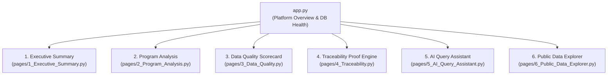

# TraceImpact 2.0 — Product & Technical Design System

> **Document Version:** 2.0.0  
> **Status:** IMPLEMENTED & VALIDATED  
> **Scope:** UX Philosophy, Information Architecture, Visual Design Tokens, Streamlit & Power BI Layouts, Component States, and Step-by-Step User Interaction Walkthroughs.

---

## 1. UX Philosophy & Design Principles

The design of TraceImpact centers on **Defensible Transparency**:
1. **Explainability Over Magic:** Dashboards should never present an aggregated number without providing a direct path to the underlying evidence and calculation method.
2. **Visual Hierarchy & Information Density:** Executives receive high-level scorecards in the top 20% of viewport; operational analysts can drill down into tabular line items and audit logs below.
3. **Rigorous Provenance Tagging:** Every KPI and visual component explicitly declares its data origin:
   - `[REAL]`: Public empirical data directly retrieved from sovereign institutions (e.g. World Bank).
   - `[MEASURED]`: Empirically computed system or pipeline performance metrics (e.g. Clean record %, Stress test RPS).
   - `[SIMULATED]`: Deterministic synthetic scenario data for audit and demonstration.
   - `[PROJECTED]`: Forward-looking statistical estimates or modeled scenarios.
4. **Mission Control Aesthetics:** High-contrast dark backgrounds (`#0A0F1A`, `#0E1117`), translucent cards (`#0D1322`), subtle borders (`#1E293B`), and vibrant functional accent colors (`#06D6A0` Emerald for Success, `#118AB2` Cyan for Info, `#FFD166` Gold for Warnings, `#EF476F` Coral for Errors).

---

## 2. Design System Tokens & Color Palette

```
┌─────────────────────────────────────────────────────────────────────────────┐
│ TRACEIMPACT DESIGN TOKENS                                                   │
├─────────────────────────────────────────────────────────────────────────────┤
│ Canvas / Base Background    : Void Dark (#0A0F1A / #0E1117)                 │
│ Card Container Surface      : Deep Navy Surface (#0D1322 @ 85% opacity)      │
│ Structural Borders          : Slate Gray (#1E293B)                          │
│ Text Primary                : Crisp White (#F8FAFC)                         │
│ Text Secondary / Muted      : Slate (#94A3B8)                               │
│ Accent Emerald (Clean / Pass): Mint Emerald (#06D6A0)                       │
│ Accent Cyan (Tech / Neutral): Electric Cyan (#118AB2)                       │
│ Accent Gold (Warning / Review): Sunburst Amber (#FFD166)                    │
│ Accent Coral (Error / Anomaly): Crimson Coral (#EF476F)                     │
│ Typography                  : Inter, -apple-system, Segoe UI, Roboto        │
│ Monospace Code              : JetBrains Mono, Fira Code, Consolas           │
└─────────────────────────────────────────────────────────────────────────────┘
```

---

## 3. Streamlit Architecture & Navigation Flow

The Streamlit portal (`http://localhost:8501`) organizes functionality into 6 dedicated pages:



### Detailed Streamlit Page Blueprints

#### `app.py` — Platform Health & Portal Overview
- **Header**: Live connection status banner (Database host, database name, user, port).
- **Metric Row**: Staged Raw Records (784), Clean Domain Records (784), Data Quality Issues (177), Tracked Public Observations (5,588).
- **Navigation Cards**: Guided deep-links to all 6 operational pages.
- **System Architecture Diagram**: Visual flowchart displaying the Bronze ➔ Silver ➔ Gold data progression.

#### `pages/1_Executive_Summary.py` — High-Level Impact Overview
- **Scorecard KPI Cards**:
  - `Total Programs`: 5
  - `Distinct Beneficiaries`: 51
  - `Total Attendance Sessions`: 612 (1,183.00 Hours)
  - `Total Expenses`: $666,950.36 (Budget: $765,000.00 / 87.18% Utilization)
  - `Avg Outcome Score Improvement`: +26.18 pts (+79.52% relative gain)
  - `Clean Record Rate`: 98.72%
- **Visual Analytics**:
  - Bar Chart: Program Budget vs Total Expenses.
  - Scatter Chart: Attendance Hours vs Outcome Score Gain.
  - Table: Program Reach Summary Matrix.

#### `pages/2_Program_Analysis.py` — Program Deep-Dive
- **Interactive Slicer**: Program dropdown selector (`PRG-001` to `PRG-005`).
- **12-Metric Program Scorecard**: Budget, expenses, participants, session hours, baseline/exit scores.
- **Tabbed Explorer**:
  - Tab 1: *Beneficiaries List* (Anonymized codes, registration dates, locations).
  - Tab 2: *Attendance Logs* (Session dates, participant check-ins, hours).
  - Tab 3: *Expense Receipts* (Voucher IDs, descriptions, amounts, receipt status).
  - Tab 4: *Outcome Evaluations* (Baseline vs exit survey scores, % change).

#### `pages/3_Data_Quality.py` — Observability & Quality Triage
- **Quality Scorecard**: Clean Data Rate (98.72%), Total Issues (177), Resolved Issues (149), Blocking Errors (10).
- **Severity Breakdown**: Donut chart displaying `ERROR` (10), `WARNING` (12), `INFO` (155).
- **Interactive Multi-Filter Grid**: Filter issue logs by File, Program, Severity, Issue Type, and Resolution Status.

#### `pages/4_Traceability.py` — 1-to-1 Cryptographic Lineage Proof Engine
- **Lineage Verification Workflow**:
  - Step 1: Select Domain Entity (`beneficiaries`, `attendance`, `expenses`, `outcomes`).
  - Step 2: Select Domain Record ID (e.g. `ATT-0001`).
  - Step 3: View relational record details and `source_record_id`.
  - Step 4: Inspect Staged Raw JSONB payload from `source_records`.
  - Step 5: Verify original CSV file name and SHA-256 cryptographic checksum from `source_files`.
  - Step 6: Verify exact 1-based row index in the physical file on disk.

#### `pages/5_AI_Query_Assistant.py` — Natural-Language Query & SQL Explainer
- **Query Input**: Text box for natural language questions + quick-select buttons for preset inquiries ("Over-budget programs", "Highest cost per participant", "Blocking errors").
- **Safety Enforcement**: SQL validator verifies query is read-only against approved Gold views.
- **Output Container**: Displays SQL code block, plain-English architectural explanation, and interactive result table.

#### `pages/6_Public_Data_Explorer.py` — Real Public Data, ML Anomalies & AI Insights
- **Macro Development Trends**: Choropleth maps and multi-year trend line charts for 264 countries across GDP, Population, Life Expectancy, and Sanitation.
- **ML Anomaly Detection**: Isolation Forest score distribution, threshold sliders, and anomaly table with feature snapshots.
- **AI Investigation Bulletins**: Side-by-side split cards (Verified Facts vs Contextual Hypotheses) with non-causality disclaimers.
- **Pipeline Monitoring**: Ingestion run execution logs, durations, and record counts.

---

## 4. Power BI Desktop & Web 9-Page Blueprint

| Page # | Page Title | Primary Visual Elements | Slicers & Interactivity |
| :--- | :--- | :--- | :--- |
| **P1** | **Executive Overview** | 8 KPI Cards (Programs, Beneficiaries, Expenses, DQ Score, WB Obs, ML Anomalies), Pipeline Health Table, Program Budget vs Expense Chart. | Pipeline Selector, Program Name. |
| **P2** | **Before vs After / Impact** | Side-by-Side Impact Matrix (Raw vs Clean), Issue Triage Bar (Raw, Resolved, Quarantined), Lineage Traceability Gauge (100%). | Dataset Selector. |
| **P3** | **Data Quality Intelligence** | Severity Donut Chart (`ERROR`, `WARNING`, `INFO`), Issue Type Bar, Granular Audit Grid with raw vs clean values. | Severity, Status, Source Pipeline. |
| **P4** | **Public Data Explorer** | Global Choropleth Map, Multi-Year Historical Trend Line (1960–2024), Regional Benchmark Matrix. | Country Multi-Select, Indicator, Region, Year Slider. |
| **P5** | **ML Anomaly Intelligence** | Anomaly Score Histogram, YoY Growth vs Score Scatter Plot, Top Anomalies Table with Feature Snapshots. | Anomaly Flag (`is_anomaly`), Indicator. |
| **P6** | **AI Investigation** | Split Panel: **OBSERVED DATA** (Left) vs **AI INTERPRETATION** (Right), Confidence Meter, Insight Catalog. | Country, Indicator, Investigation ID. |
| **P7** | **Pipeline / Ingestion Monitor**| Ingestion Execution Timeline, 100% Success Rate Gauge, Operational History Grid (Runs, Records, Durations). | `run_status`, Endpoint URL. |
| **P8** | **Scale & Stress Test** | Throughput Bar Chart (1K–100K RPS), Processing Duration Curve, Peak Memory Usage (303–417 MB). | Workload Size (1K to 100K). |
| **P9** | **Traceability / Data Lineage**| 7-Step Lineage Sankey/Grid (`API ➔ Raw JSON (SHA-256) ➔ Obs ➔ ML ➔ AI ➔ Insight`), Lineage Completeness Gauge. | Observation ID, Hash Search. |

---

## 5. UI Component States & Error Handling

- **Loading States**: Spinners (`st.spinner("Executing query...")`) with visual execution timers.
- **Empty States**: Clear instructional banners (e.g. *"No data quality issues match the selected filters. Select 'ALL' to view resolved records."*).
- **Error States**: Non-crashing alert callouts (`st.error("Database connection lost")`) providing host/port diagnostic details without leaking passwords.
- **Accessibility & Contrast**: All text elements meet WCAG AA contrast ratio ($\ge 4.5:1$) against dark backgrounds.
- **Reduced-Motion Consideration**: Dashboard transitions use instant DOM updates without distracting auto-playing CSS animations.

---

## 6. Step-by-Step User Walkthroughs

### 1. Opening TraceImpact & Inspecting Platform Health
When a user launches `app.py`:
1. The top header immediately executes a PostgreSQL connection ping.
2. If healthy, a green badge displays: `Database: traceimpact on localhost:5432 (PostgreSQL 14+)`.
3. 4 metric cards summarize total volume: 784 staged rows, 784 domain rows, 177 quality issues, and 5,588 public observations.
4. The user clicks **Executive Summary** to enter the reporting layer.

### 2. Investigating a Data Quality Issue
When a data quality analyst navigates to Page 3:
1. The user reviews the severity chart showing 10 `ERROR` items.
2. The user selects `Severity = ERROR` in the sidebar filter.
3. The issue table filters down to the 10 blocking records (e.g. `EXP-0004` with negative amount `-₹4,500.00`).
4. The user notes that the issue status is `QUARANTINED`, confirming that this negative expense was blocked from corrupting the financial KPI calculations.

### 3. Inspecting an ML Anomaly & Grounded AI Investigation
When an analyst opens Page 6:
1. The user scrolls to the **Machine Learning Anomaly Detection** section.
2. The user sees a point in the scatter plot corresponding to Central African Republic (Life Expectancy 2019, Anomaly Score: -0.1670).
3. The user opens the **AI Investigation Bulletin** below.
4. Left Card (**Observed Data**) displays: Multi-year mean 46.47, reported 31.53, Z-score -1.60, YoY change -39.71%.
5. Right Card (**AI Interpretation**) displays: Hypothesizes severe reporting methodology adjustments or disruption, accompanied by the explicit Non-Causality Disclaimer.

### 4. Tracing a KPI to Source
When an auditor verifies the number of session hours for Digital Literacy on Page 4:
1. The user selects entity `attendance` and record ID `ATT-0001`.
2. The UI renders the clean domain record: Program `PRG-001`, Hours `2.0`.
3. The UI queries `source_records` using `source_record_id = 1` and displays the raw JSON: `{"hours": "2 hrs", "participant_id": "BEN-0001"}`.
4. The UI displays the file name `attendance.csv` and SHA-256 hash `c35bcf94...`.
5. The UI verifies that Line 2 of `data/raw/attendance.csv` on disk contains the exact matching string.
