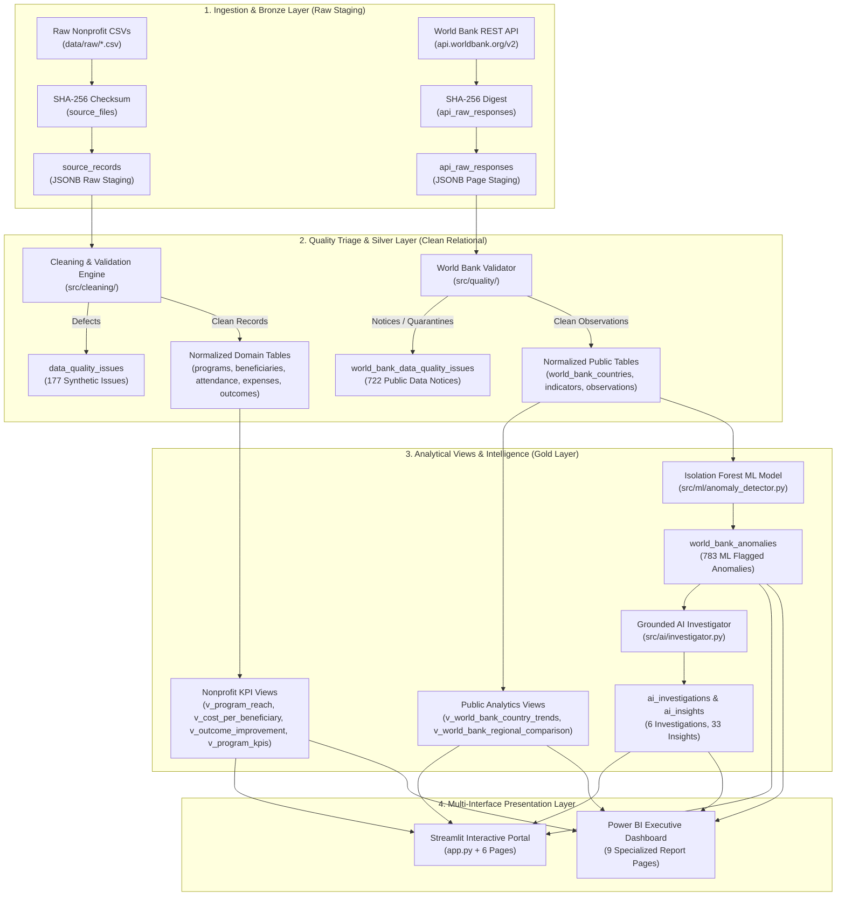
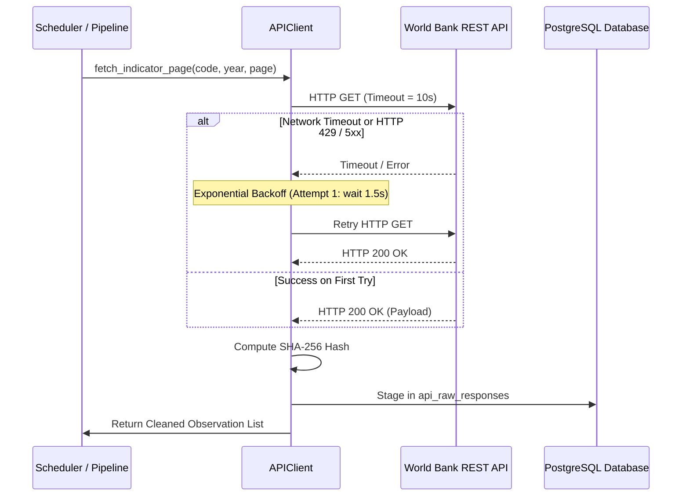

# TraceImpact 2.0 — System Execution & Data Flow Specifications

> **Document Version:** 2.0.0  
> **Status:** IMPLEMENTED & VALIDATED  
> **Scope:** End-to-End System Execution, Ingestion, Quality Triage, Analytics, ML Anomaly Detection, AI Investigation, Traceability, and Multi-Interface Presentation Flows.

---

## 1. Real-Life System Analogy & Core Principle

### The Core Architectural Principle
> **"Every reported number must possess an explainable, unbroken data provenance path back to the physical record that produced it."**
> 
> *Crucial Clarification:* Data lineage proves the digital provenance and cryptographic integrity of records within the platform. It does not claim to prove physical real-world events occurred, but demonstrates that the numbers on executive dashboards match the exact raw records received from field staff and public APIs.

### Real-World Nonprofit & Public Data Scenario
Consider an international development organization operating education, healthcare, and livelihood programs across multiple regions while tracking national macroeconomic indicators:
1. **Field Reality:** Branch offices submit raw CSV spreadsheets (`attendance.csv`, `beneficiaries.csv`, `expenses.csv`, `outcomes.csv`) filled with human inconsistencies: currency symbols (`₹`, `$`), diverse date formats (`DD/MM/YYYY`, `YYYY-MM-DD`), duplicate check-ins, negative expense vouchers, and missing exit scores.
2. **Public Data Reality:** The organization monitors national indicators from the World Bank API (`NY.GDP.PCAP.CD`, `SP.POP.TOTL`) to correlate public trends with local interventions, requiring resilient REST ingestion that handles pagination, rate limits, and missing historical years.
3. **TraceImpact Solution:** Rather than discarding defective data or running opaque black-box scripts, TraceImpact ingests raw data immutably, categorizes anomalies into an auditable data quality log, cleans records non-destructively, populates normalized domain models, executes unsupervised ML anomaly detection, runs evidence-grounded AI investigations, and renders unified analytics across Streamlit and Power BI with 1-to-1 drill-down to the original raw byte payload.

---

## 2. High-Level System Architecture Flow



---

## 3. Detailed End-to-End Component Flows

### Flow A: Synthetic Nonprofit CSV Pipeline
```
[Physical CSV File on Disk]
  ↓ (Read file bytes & compute SHA-256 hash)
[Register source_files entry: file_id, file_hash, total_rows]
  ↓ (Iterate rows with 1-based index)
[Stage source_records: record_id, file_id, row_index, raw_data JSONB]
  ↓ (Execute src/cleaning/run_pipeline.py)
[1. Canonical Header Mapping (column_maps.py)]
[2. Date & Currency Normalization (normalizers.py)]
[3. Program Name & Geographic Resolution]
[4. PII Pseudonymization: Salted SHA-256 hash -> anonymized_code]
[5. Business Constraint Validation (validators.py)]
  ├─ ERROR (Blocking): Quarantined from domain tables -> Logged in data_quality_issues
  ├─ WARNING (Non-blocking): Stored with audit notice -> Logged in data_quality_issues
  └─ INFO (Sanitized): Formatted and loaded -> Logged in data_quality_issues
  ↓ (Load Clean Data)
[Domain Relational Tables: programs, beneficiaries, attendance, expenses, outcomes]
  ↓ (Foreign Key Enforced)
[source_record_id FK preserves direct link back to source_records.record_id]
```

#### Step-by-Step Stage Breakdown
| Stage | Input | Process | Output | Storage Target | Failure Handling | Traceability Link |
| :--- | :--- | :--- | :--- | :--- | :--- | :--- |
| **Bronze Staging** | `data/raw/*.csv` | Calculate SHA-256, read lines verbatim | Ingested file & record rows | `source_files`, `source_records` | Abort on read failure; log file error | `file_hash`, `row_index` |
| **Cleaning** | `source_records.raw_data` | Strip symbols, resolve dates, map program aliases | Cleaned in-memory dictionary | `data/processed/*.csv` | Regex fallback; impossible dates flagged | `source_record_id` |
| **Quality Audit** | Cleaned candidate dict | Evaluate 12 validation rules | Issue records with severity | `data_quality_issues` | Log issue; continue batch | `record_id`, `row_num` |
| **Domain Load** | Validated records | Upsert into relational schema | Normalized domain rows | `beneficiaries`, `attendance`, `expenses`, `outcomes` | Transaction rollback on FK failure | `source_record_id` FK |

---

### Flow B: World Bank Public API Ingestion Pipeline
```
[Automated Scheduler (src/ingestion/scheduler.py) or CLI Trigger]
  ↓ (Construct HTTP GET request with retry & backoff)
[APIClient: api.worldbank.org/v2/country/all/indicator/{code}?date=2018:2021&per_page=500]
  ↓ (Receive HTTP 200 JSON Response)
[Compute SHA-256 Hash of raw byte payload]
  ↓ (Log Ingestion Run in api_ingestion_runs: status=RUNNING)
[Persist Bronze Stage: api_raw_responses (run_id, page_number, response_hash, raw_payload JSONB)]
  ↓ (Iterate JSON Observations Array)
[WorldBankValidator (src/quality/world_bank_quality.py)]
  ├─ Valid Observation: Upsert to world_bank_observations (ON CONFLICT DO UPDATE)
  ├─ Missing Value (Null): Logged as INFO in world_bank_data_quality_issues (Omitted from obs)
  └─ Malformed Value (Non-numeric): Logged as ERROR in world_bank_data_quality_issues (Quarantined)
  ↓ (Update api_ingestion_runs: status=COMPLETED, records_inserted, duration_seconds)
[Materialize Gold Layer SQL Views: v_world_bank_*]
```

#### Step-by-Step Stage Breakdown
| Stage | Input | Process | Output | Storage Target | Failure Handling | Traceability Link |
| :--- | :--- | :--- | :--- | :--- | :--- | :--- |
| **API Request** | Indicator code & year range | HTTP GET via `requests.Session` | Raw JSON Response | Memory buffer | 3 retries, exponential backoff (1.5x) | `endpoint_url`, `params` |
| **Bronze Raw** | Raw JSON text | SHA-256 digest, parse JSON | Staged API page payload | `api_raw_responses` | Fail run if JSON malformed | `response_hash`, `page_number` |
| **Validation** | Observation object | Check ISO codes, year bounds, float format | Valid observation vs defect notice | `world_bank_data_quality_issues` | Quarantine invalid rows; continue batch | `raw_response_id`, `raw_record_index` |
| **Domain Upsert** | Validated observation | Idempotent SQL UPSERT | Normalized observation | `world_bank_observations` | Database transaction commit/rollback | `(country, indicator, year)` UK |

---

### Flow C: Machine Learning Anomaly Detection Flow
```
[world_bank_observations Table (5,588 Rows)]
  ↓ (Query multi-year historical series)
[WorldBankFeatureExtractor (src/ml/feature_extractor.py)]
  ├─ Feature 1: Multi-year historical country Z-Score
  ├─ Feature 2: Year-over-Year (YoY) Growth %
  ├─ Feature 3: Global Peer Group Z-Score (same reporting year)
  └─ Feature 4: Historical Baseline Ratio
  ↓ (Assemble (N, 4) Feature Matrix)
[IsolationForest Model (sklearn.ensemble.IsolationForest)]
  ├─ Hyperparameters: n_estimators=100, contamination=0.04, random_state=42
  ├─ Output 1: Continuous anomaly score (-0.50 to +0.50)
  └─ Output 2: Binary anomaly classification (is_anomaly: True/False)
  ↓ (Register Model in ml_anomaly_models)
[Persist Model Weights to models/IsolationForest_WorldBank_v1.0.0.joblib]
  ↓ (Idempotent Database Upsert)
[world_bank_anomalies Table (ON CONFLICT (observation_id, model_version) DO UPDATE)]
```

---

### Flow D: Grounded AI Investigation & Insight Generation Flow
```
[world_bank_anomalies (Flagged is_anomaly = True)]
  ↓ (Filter top anomalous observations by decision score)
[WorldBankInvestigator (src/ai/investigator.py)]
  ↓ (Compile Structured Empirical Evidence)
  ├─ 1. Query full historical time series for country and indicator
  ├─ 2. Calculate empirical multi-year mean, standard deviation, and Z-score
  ├─ 3. Query co-occurring development indicators for the same country-year
  └─ 4. Structure JSON evidence package
  ↓ (Execute LLM Synthesis or Grounded Rule-Based Engine)
[Format Finding Summary with Strict Facts vs Hypotheses Segregation]
  ├─ Section 1: VERIFIED FACTS (Empirical values, standard deviations, growth rates)
  ├─ Section 2: CONTEXTUAL HYPOTHESES (Methodological adjustments, reporting revisions)
  ├─ Section 3: METHODOLOGICAL LIMITATIONS (Observational boundary statement)
  └─ Section 4: MANDATORY NON-CAUSALITY DISCLAIMER
  ↓ (Persist Audit Records)
[ai_investigations (1-to-1 link to anomaly_id)]
  ↓ (Generate Actionable Bulletins)
[ai_insights (Feed of categorized insights with underlying metrics JSONB)]
```

---

### Flow E: Natural-Language AI Query Assistant Flow
```
[User Types Natural Language Question in Streamlit Page 5]
  ↓ (E.g. "Which programs are over budget?")
[AIAssistantEngine (src/dashboard/ai_assistant.py)]
  ↓ (Intent Classifier: Matches question to PRESET_QUERIES or Generates SQL Candidate)
[SQL Security Validator]
  ├─ 1. Read-Only Token Check: Permits ONLY 'SELECT' and 'WITH'
  ├─ 2. Disallowed Token Check: Rejects 'DROP', 'DELETE', 'INSERT', 'UPDATE', 'ALTER', 'TRUNCATE'
  ├─ 3. Anti-Chaining Check: Blocks semicolons ';' and comment tokens '--', '/*'
  └─ 4. Table Whitelist: Restricts access strictly to approved Gold views ('v_program_*', 'v_data_quality_*')
  ↓ (Execute Safe Query via Parameterized SQLAlchemy Engine)
[Query PostgreSQL Database (Timeout: 5.0 seconds)]
  ↓ (Receive Result Set Dataframe)
[Format Visual Table + Natural-Language Architectural Explanation]
  ↓ (Render in UI with Copyable SQL Block)
```

---

## 4. End-to-End Traceability Flows

### 1. Synthetic Domain Metric ➔ Physical Source CSV Lineage
```
[Executive Metric: Total Program Hours = 224.0 hrs (Digital Literacy)]
  ↓ (v_program_reach aggregates attendance.session_hours WHERE program_id = 'PRG-001')
[attendance Table: Row ID 1, attendance_id = 'ATT-0001', session_hours = 2.0]
  ↓ (attendance.source_record_id = 1)
[source_records Table: record_id = 1, file_id = 2, row_index = 1, raw_data = {"hours": "2 hrs", ...}]
  ↓ (source_records.file_id = 2)
[source_files Table: file_id = 2, file_name = 'attendance.csv', file_hash = 'c35bcf94...']
  ↓ (Direct Verification on Disk)
[Physical File: data/raw/attendance.csv at Line 2 (Header = Line 1)]
```

### 2. AI Insight ➔ World Bank API Raw JSON Payload Lineage
```
[Executive Insight: "Sharp Contraction in Central African Republic Life Expectancy (2019)"]
  ↓ (ai_insights.investigation_id = 1)
[ai_investigations Table: investigation_id = 1, anomaly_id = 38]
  ↓ (ai_investigations.anomaly_id = 38)
[world_bank_anomalies Table: anomaly_id = 38, observation_id = 1842, anomaly_score = -0.1670]
  ↓ (world_bank_anomalies.observation_id = 1842)
[world_bank_observations Table: observation_id = 1842, raw_response_id = 14, raw_record_index = 3]
  ↓ (world_bank_observations.raw_response_id = 14)
[api_raw_responses Table: response_id = 14, run_id = 5, response_hash = 'ad0fe55f...', raw_payload JSONB]
  ↓ (api_raw_responses.run_id = 5)
[api_ingestion_runs Table: run_id = 5, endpoint = 'http://api.worldbank.org/v2/country/all/...']
```

---

## 5. Resilience, Retries, and Idempotency Architecture

### Resilient Retry Flow


### Idempotent Database Upsert Design
All data ingestion operations in TraceImpact are strictly idempotent:
- **Synthetic Domain Tables**: Master program codes (`PRG-001`–`PRG-005`) and unique transaction codes (`BEN-0001`, `ATT-0001`, `EXP-0001`, `OUT-0001`) use `ON CONFLICT (id) DO UPDATE` or pre-load validation to guarantee that re-running pipelines never creates duplicate rows.
- **World Bank Observations**: Primary key / unique constraint on `(country_code, indicator_code, year)` ensures that re-ingesting a historical dataset updates existing metrics without altering primary keys or row counts.
- **ML Anomalies**: Unique constraint on `(observation_id, model_version)` allows updated scoring without duplicating anomaly logs.

---

## 6. Multi-Interface Presentation Flows

```
                             +-------------------------------+
                             |  PostgreSQL 14+ Gold Views   |
                             |  (v_pbi_*, v_program_kpis)    |
                             +-------------------------------+
                                             |
                     +-----------------------+-----------------------+
                     |                                               |
                     v                                               v
     +-------------------------------+               +-------------------------------+
     |  Streamlit Analytics Portal   |               |  Power BI Executive Dashboard |
     |  (Port: 8501, Python Native)  |               |  (9 Report Pages, Web/Desktop)|
     +-------------------------------+               +-------------------------------+
     | 1. Executive Summary          |               | 1. Executive Overview         |
     | 2. Program Analysis           |               | 2. Before vs After / Impact   |
     | 3. Data Quality Scorecard     |               | 3. Data Quality Intelligence  |
     | 4. Traceability Proof Engine  |               | 4. Public Data Explorer       |
     | 5. AI Query Assistant         |               | 5. ML Anomaly Intelligence    |
     | 6. Public Data Explorer       |               | 6. AI Evidence & Investigation|
     |                               |               | 7. Pipeline Ingestion Monitor |
     | * Interactive SQL Drill-Down  |               | 8. Scale & Stress Test (100K) |
     | * Real-Time DB Health Checks  |               | 9. Cryptographic Data Lineage |
     +-------------------------------+               +-------------------------------+
```

---

## 7. Component Status & Verification Matrix

| Flow Component | Implementation Status | Key Module File | Primary Verification Test |
| :--- | :--- | :--- | :--- |
| **Synthetic CSV Ingestion** | ✅ IMPLEMENTED | `src/cleaning/run_pipeline.py` | `tests/test_day2.py` |
| **World Bank API Ingestion** | ✅ IMPLEMENTED | `src/ingestion/world_bank.py` | `tests/test_world_bank.py` |
| **Data Quality Triage** | ✅ IMPLEMENTED | `src/cleaning/validators.py` | `tests/test_day4.py` |
| **Medallion Gold Views** | ✅ IMPLEMENTED | `sql/views.sql`, `sql/views_quality.sql` | `tests/test_day3.py` |
| **Isolation Forest ML** | ✅ IMPLEMENTED | `src/ml/anomaly_detector.py` | `tests/test_ml_and_ai.py` |
| **Grounded AI Investigator** | ✅ IMPLEMENTED | `src/ai/investigator.py` | `tests/test_ml_and_ai.py` |
| **AI Query Assistant** | ✅ IMPLEMENTED | `src/dashboard/ai_assistant.py` | `tests/test_day7.py` |
| **1-to-1 Cryptographic Lineage**| ✅ IMPLEMENTED | `pages/4_Traceability.py` | `tests/test_day6.py` |
| **Automated Scheduler** | ✅ IMPLEMENTED | `src/ingestion/scheduler.py` | `tests/test_world_bank.py` |
| **Streamlit 6-Page Portal** | ✅ IMPLEMENTED | `app.py`, `pages/*.py` | `tests/test_day5.py` |
| **Power BI 9-Page Layer** | ✅ IMPLEMENTED | `power_bi/`, `src/power_bi_export.py` | `src/power_bi_validator.py` |
| **100K Scale Stress Harness** | ✅ IMPLEMENTED | `tests/stress_test_suite.py` | Empirical Benchmark Runner |
| **Cloud Object Storage (S3/ADLS)**| 📋 PLANNED (Future) | N/A (Architecture Spec Only) | N/A |
