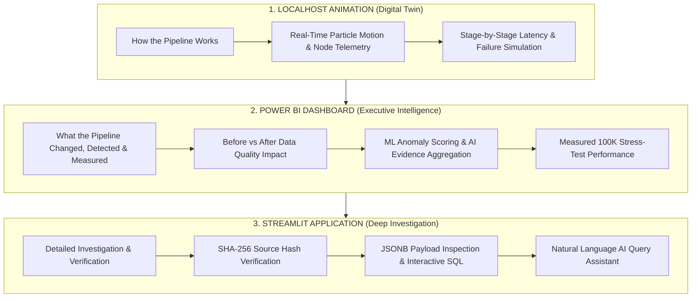
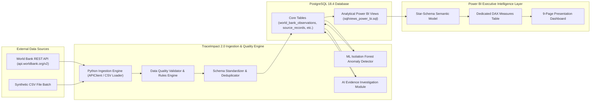

# TraceImpact 2.0 — Power BI Architecture & Presentation Layer

> **Executive Summary**: This document details the architectural positioning, design principles, data flow pipelines, and technical integration of the Power BI Executive Intelligence & Impact Layer for TraceImpact 2.0.

---

## 1. Architectural Positioning & The Three-Tier Experience

TraceImpact 2.0 provides a complementary three-tier presentation and analytics experience designed specifically for executive leadership, analytics teams, and hackathon judges:

### Purpose Breakdown

| Interface | Primary Audience | Core Question Answered | Key Capabilities |
| :--- | :--- | :--- | :--- |
| **Localhost Animation** | Hackathon Judges & Technical Auditors | *How does the system process data?* | Dynamic particle visualizer, 14 pipeline stages, Failure Lab, Judge Mode, live stress slider (1K–1M). |
| **Power BI Layer** | Executive Leadership & Board Members | *What did the pipeline change, detect, and measure?* | Star-schema analytics, Before vs After DQ impact, ML anomaly trends, AI evidence segregation, 100K benchmark metrics. |
| **Streamlit App** | Data Engineers & Domain Investigators | *Can the results be trusted and verified?* | End-to-end 4-step traceability, raw JSONB payload inspection, data quality resolution workflows, NL query assistant. |

---

## 2. End-to-End Data Pipeline & Integration Flow

The Power BI presentation layer operates exclusively on curated analytical database views created in PostgreSQL (`sql/views_power_bi.sql`). It **never** fetches third-party APIs directly, ensuring decoupled, deterministic, and high-performance analytical reporting.

---

## 3. Data Provenance Framework

To maintain absolute integrity during executive reviews and hackathon evaluations, every visual metric and KPI in the Power BI dashboard is strictly tagged with its explicit data provenance:

- `[REAL]`: Authentic data extracted directly from public APIs (e.g., World Bank GDP, Population, CO2 emissions, School Enrollment data for 264 countries across 1960–2024).
- `[MEASURED]`: Empirical measurements produced directly by the local TraceImpact processing engine, ML models, or stress-test execution harness (e.g., 98.72% synthetic clean record rate, 55,578.6 ML ops/sec, 4,000 anomalies on 100K stress test).
- `[SIMULATED]`: Controlled baseline data generated for testing or demo scenario validation (e.g., synthetic nonprofit program attendance, expenses, and outcome scores).
- `[PROJECTED]`: Statistically derived extrapolations based on measured benchmarks (e.g., estimated processing time for 1,000,000 records derived from the 100K batch benchmark).

---

## 4. Technical Specifications & Power BI Setup

- **Database Engine**: PostgreSQL 18.4 (Homebrew) / 14+ compatible.
- **Port / Host**: `localhost:5432`, Database `traceimpact`.
- **Authentication**: Native PostgreSQL Credentials (env-configured, never hardcoded).
- **Power BI Connectivity**: Import Mode (for offline hackathon presentations) with optional DirectQuery for real-time dashboard updates.
- **Query Folding**: 100% enabled for all fact and dimension tables via database views (`sql/views_power_bi.sql`).

---

## 5. Security & Privacy Guarantees

1. **No Hardcoded Credentials**: Connection settings use standard ODBC/PostgreSQL DSNs or environment-level parameters.
2. **Read-Only Database Access**: Power BI connects using a restricted read-only PostgreSQL role (`grant select on all tables in schema public to powerbi_user`).
3. **No Secret Leakage**: `.env` files, API tokens, and database passwords are strictly excluded from `.pbix` artifacts and git repositories.
