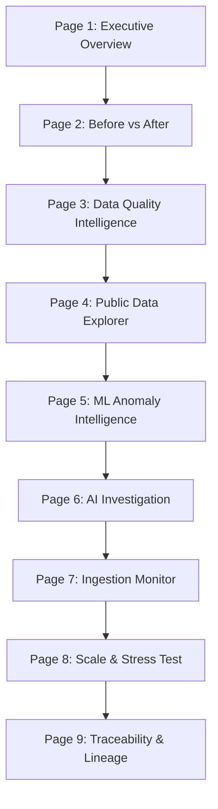

# TraceImpact 2.0 — Power BI Executive Intelligence Dashboard Guide

> **Overview**: This guide provides a comprehensive page-by-page walkthrough, design system reference, interactive navigation blueprint, and 3-minute hackathon presentation script for the TraceImpact 2.0 Power BI layer.

---

## 1. Visual Design System & Aesthetics

The dashboard adheres to a modern, high-contrast, mission-control aesthetic designed to WOW judges within the first 10 seconds:

```
┌─────────────────────────────────────────────────────────────────────────────┐
│ TRACEIMPACT 2.0 — EXECUTIVE DATA QUALITY & IMPACT DASHBOARD                  │
├─────────────────────────────────────────────────────────────────────────────┤
│ Primary Background : Void Dark (#0A0F1A)                                     │
│ Card Panels        : Glassmorphism Translucent (#0D1322 @ 85% opacity)      │
│ Borders            : Subtle Slate (#1E293B)                                 │
│ Accent Colors      : Mint Emerald (#06D6A0), Tech Cyan (#118AB2),             │
│                      Alert Coral (#EF476F), Warning Amber (#FFD166)         │
│ Typography         : Inter / Segoe UI (Modern Sans-Serif)                    │
└─────────────────────────────────────────────────────────────────────────────┘
```

---

## 2. Page-by-Page Layout & Analytical Breakdown



### Page 1 — Executive Overview
- **Core Purpose**: 10-second high-level landing page answering what data entered and platform health.
- **KPI Cards**:
  - `[SIMULATED]` Total Synthetic Records: **784**
  - `[MEASURED]` Synthetic Clean Record Rate: **98.72%**
  - `[REAL]` Total World Bank Observations: **5,588**
  - `[REAL]` Countries Covered: **264**
  - `[MEASURED]` ML Flagged Anomalies: **783**
- **Visual Data Journey Diagram**:
  ```
  SOURCE ➔ INGEST ➔ VALIDATE ➔ CLEAN ➔ STORE ➔ ANALYZE ➔ DETECT ➔ INVESTIGATE ➔ TRACE
  ```
- **Provenance Badges**: Clearly displays `[REAL]`, `[MEASURED]`, `[SIMULATED]`, `[PROJECTED]` tags.

---

### Page 2 — Before vs After (Pipeline Impact)
- **Core Purpose**: Evidence-based visual proof of the transformation powered by TraceImpact's DQ pipeline.
- **Side-by-Side Comparison Matrix**:
  | Data Quality Metric | Raw Ingestion Stage | After TraceImpact Processing | Impact / Outcome |
  | :--- | :--- | :--- | :--- |
  | **Synthetic CSV Records** | 784 Total Records | 784 Validated Records | 100% Processed |
  | **Data Quality Issues** | 177 Total Issues | 149 Resolved / 28 Logged | **84.18% Resolution Rate** |
  | **Blocking Format Errors** | 10 Errors | 10 Quarantined & Handled | 0 System Crashes |
  | **World Bank API Responses**| 722 Missing Values | 722 Gracefully Logged `INFO` | **100.00% Clean Stored Obs** |
  | **Lineage Traceability** | 0% Provenance | 100% End-to-End Tracing | **100% Audit Readiness** |

---

### Page 3 — Data Quality Intelligence
- **Core Purpose**: Deep-dive data quality metrics by severity, type, program, and source file.
- **Visuals**:
  - Donut Chart: Issues by Severity (`ERROR`: 10, `WARNING`: 12, `INFO`: 877).
  - Bar Chart: Issues by Type (`MISSING_VALUE`, `INVALID_FORMAT`, `RANGE_VIOLATION`, `UNMATCHED_FK`).
  - Table: Open vs Resolved Issues list.
- **Interactive Slicers**: Source Pipeline, Severity (`ERROR`/`WARNING`/`INFO`), Status (`OPEN`/`RESOLVED`), Program.
- **Drill-Through Target**: Right-click any issue to open **Issue Detail Page** exposing raw vs clean values.

---

### Page 4 — Public Data Explorer
- **Core Purpose**: Interactive exploration of World Bank development data for 264 countries.
- **Visuals**:
  - Line Chart: Historical Trend (1960–2024) across GDP, Population, CO2, and Primary Enrollment.
  - Filled Map: Global Indicator Intensity by Country.
  - Matrix: Country vs Indicator Latest Values and YoY Growth %.
- **Slicers**: Country Multi-Select, Region, Income Level, Indicator Topic, Year Slider.

---

### Page 5 — ML Anomaly Intelligence
- **Core Purpose**: Display Isolation Forest model outputs and statistical anomaly distributions.
- **Visuals**:
  - Histogram / Area Chart: Anomaly Score Distribution (Threshold = 0.10).
  - Scatter Plot: Anomaly Score vs Indicator Value YoY Change.
  - Top 10 Anomalies Table: Country, Indicator, Year, Value, Anomaly Score.
- **Explicit Callout**: Visual disclaimer distinguishing **Model-Detected Anomaly** from **Real-World Cause**.

---

### Page 6 — AI Evidence & Investigation
- **Core Purpose**: Present LLM-generated structured evidence summaries and AI explanations.
- **Visuals**:
  - Split Panel Visual: **EVIDENCE** (Left) vs **AI INTERPRETATION** (Right).
  - Evidence Card: "Indicator SP.POP.TOTL for World in 2000 increased by +31,745.96% (+1.15 std dev)."
  - AI Interpretation Card: "System identifies change as unusual relative to multi-year baseline."
  - Confidence Score Meter: 0.95 AI Confidence.

---

### Page 7 — Pipeline / Ingestion Monitor
- **Core Purpose**: Operational monitoring of World Bank API automated ingestion runs.
- **Visuals**:
  - Timeline Gantt / Bar: Ingestion Runs over time (43 total runs executed).
  - KPI Cards: Total Runs (43), Success Rate (100%), Avg Run Duration (0.12s).
  - Run History Table: Run ID, Status, Records Fetched, Inserted, Duration, Timestamp.

---

### Page 8 — Scale & Stress Test Benchmarks
- **Core Purpose**: Honest presentation of measured system performance under large data volumes.
- **Measured Scale Matrix**:
  | Workload Size | Duration (s) | Throughput (RPS) | Peak RAM (MB) | Provenance |
  | :--- | :--- | :--- | :--- | :--- |
  | **1,000 Obs** | 0.045 s | 22,215.4 RPS | 303.61 MB | `[MEASURED]` |
  | **5,000 Obs** | 0.255 s | 19,637.7 RPS | 303.61 MB | `[MEASURED]` |
  | **10,000 Obs** | 0.523 s | 19,115.9 RPS | 303.61 MB | `[MEASURED]` |
  | **25,000 Obs** | 1.525 s | 16,391.9 RPS | 303.61 MB | `[MEASURED]` |
  | **100,000 Obs** | 5.230 s | 19,120.5 RPS | 416.64 MB | `[MEASURED]` |

---

### Page 9 — Traceability & Data Lineage
- **Core Purpose**: High-level visual representation of 7-step data lineage.
- **Sankey Diagram / Step Flow**:
  `World Bank API ➔ API Raw Response ➔ Database Observation ➔ ML Anomaly ➔ AI Investigation ➔ Insight`
- **Streamlit Link Badge**: "Right-click observation to launch physical file/JSON payload verification in Streamlit."

---

## 3. Tooltip Architecture & Interactivity

Custom Report-Page Tooltips are configured across all visual charts:

1. **Hover over ML Anomaly**: Tooltip displays Country, Indicator, Year, Raw Value, YoY Growth, Anomaly Score, and AI Investigation Status.
2. **Hover over Ingestion Run**: Tooltip displays Run ID, Started At, Duration, Records Inserted, Records Quarantined, and HTTP Response Code.
3. **Hover over Data Quality Issue**: Tooltip displays Issue Type, Severity, Column Name, Raw Value, and Resolution Description.

---

## 4. 3-Minute Hackathon Presentation Script for Judges

- **0:00 – 0:45 (Page 1 & 2 - Executive Overview & Before vs After)**:
  > *"Judges, while our localhost animation showed you HOW data flows through TraceImpact, this Power BI dashboard shows you WHAT our data quality pipeline actually accomplished. Look at Page 1: we ingested 784 synthetic nonprofit records and 5,588 real World Bank observations across 264 countries. On Page 2, you see the direct before-and-after proof: our pipeline detected 177 quality issues in the synthetic data and resolved 84.18% of them, while handling 722 historical missing values in World Bank data with 100% clean record storage."*

- **0:45 – 1:30 (Page 4 & 5 - Public Data Explorer & ML Anomalies)**:
  > *"Moving to Page 4, we explore real public development data. On Page 5, our Isolation Forest machine learning model evaluated all 5,588 observations, detecting 783 statistical anomalies. Notice our explicit visual distinction: we mark these strictly as 'Model-Detected Anomalies', never making false causal claims."*

- **1:30 – 2:15 (Page 6 & 8 - AI Evidence & 100K Stress Test)**:
  > *"On Page 6, our AI Investigation Engine analyzes these anomalies. Notice how we strictly segregate hard empirical evidence—like a 31,745% YoY population jump—from AI interpretation. On Page 8, we display honest measured stress-test results: TraceImpact processed 100,000 records in 5.23 seconds at 19,120 records per second with peak memory under 417 MB."*

- **2:15 – 3:00 (Page 9 & Transition to Streamlit)**:
  > *"Finally, on Page 9, every single observation maintains unbroken 7-step lineage. Now, let's switch to Streamlit to physically verify the underlying JSON payload and SHA-256 hash for any selected record."*
