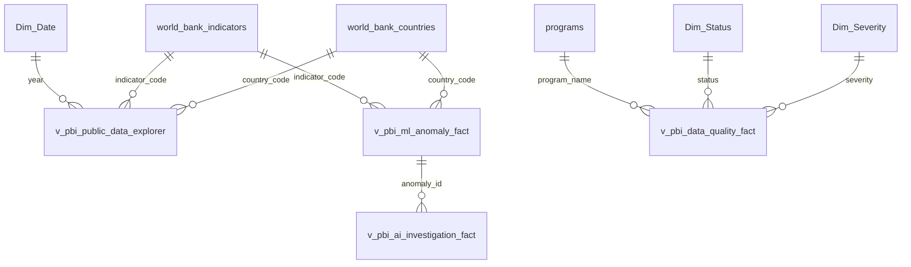

# TraceImpact 2.0 — Power BI Data Model & Semantic Architecture

> **Overview**: This document defines the relational schema, star-schema layout, dimension-to-fact relationships, technical column hiding rules, and comprehensive source-to-visual mapping for the TraceImpact 2.0 Power BI model.

---

## 1. Data Model Architecture (Star Schema)

The semantic model follows a star-schema design pattern to ensure high query performance, clean filter propagation, and predictable DAX behavior.



---

## 2. Table Inventory & Entity Types

### Fact Tables (Measures & Transactional Events)

| Power BI Table Name | Underlying PostgreSQL Source | Grain / Row Key | Row Count | Primary Purpose |
| :--- | :--- | :--- | :--- | :--- |
| `Fact_PublicExplorer` | `v_pbi_public_data_explorer` | `observation_id` | 5,812 | Main analytical observations for World Bank indicators. |
| `Fact_DataQuality` | `v_pbi_data_quality_fact` | `issue_id` | 899 | Unified data quality audit log (177 synthetic + 722 World Bank). |
| `Fact_MLAnomalies` | `v_pbi_ml_anomaly_fact` | `anomaly_id` | 794 | Isolation Forest model anomaly scores and feature snapshots. |
| `Fact_AIInvestigations` | `v_pbi_ai_investigation_fact` | `investigation_id` | 17 | LLM structured evidence summaries and AI explanations. |
| `Fact_IngestionMonitor` | `v_pbi_ingestion_monitor` | `run_id` | 43 | Automated World Bank REST API operational ingestion runs. |
| `Fact_StressTest` | `v_pbi_stress_test_benchmarks` | `workload_size` | 5 | Measured pipeline timings, throughput (RPS), and memory (MB). |
| `Fact_BeforeAfter` | `v_pbi_before_after` | `dataset_name` | 2 | Side-by-side comparative raw vs clean dataset metrics. |
| `Fact_Lineage` | `v_pbi_end_to_end_lineage` | `observation_id` | 5,823 | 7-step lineage mapping from API response to AI insight. |
| `Fact_ExecKPIs` | `v_pbi_executive_kpis` | `pipeline_name` | 2 | High-level landing page summary metrics. |

### Dimension Tables (Filter Context & Categorization)

| Power BI Table Name | Underlying PostgreSQL Source | Primary Key | Row Count | Attributes |
| :--- | :--- | :--- | :--- | :--- |
| `Dim_Country` | `world_bank_countries` | `country_code` | 264 | Country Name, Region, Income Level, Lending Type, Capital. |
| `Dim_Indicator` | `world_bank_indicators` | `indicator_code` | 4 | Indicator Name, Topic, Unit of Measure, Source Org. |
| `Dim_Program` | `programs` | `program_id` | 5 | Program Name, Target Category, Budget Allocated. |
| `Dim_Date` | Derived DAX Calendar Table | `Date` / `Year` | 65 | Year (1960–2024), Decade, Century. |
| `Dim_Severity` | Static Values | `severity` | 3 | ERROR, WARNING, INFO. |
| `Dim_Status` | Static Values | `status` | 3 | OPEN, RESOLVED, QUARANTINED. |

---

## 3. End-to-End Source-to-Visual Mapping Matrix

```
TraceImpact Source
  └─ PostgreSQL Table / View
       └─ Power BI Table
            └─ Power BI Relationship
                 └─ Power BI DAX Measure
                      └─ Power BI Visual & Page Location
```

| TraceImpact Source Component | PostgreSQL Table / View | Power BI Table | Relationship Key | Key DAX Measure | Target Visual & Dashboard Page |
| :--- | :--- | :--- | :--- | :--- | :--- |
| **Synthetic CSV Ingestion Engine** | `source_records`, `v_data_quality_summary` | `Fact_ExecKPIs` | N/A (Summary) | `[Synthetic Total Records]` | KPI Card (Page 1: Executive Overview) |
| **Data Quality Rules Engine** | `v_data_quality_summary` | `Fact_ExecKPIs` | N/A (Summary) | `[Synthetic Clean Record Rate %]` | Gauge / KPI Card (Page 1 & Page 3) |
| **Data Quality Audit Log** | `data_quality_issues`, `source_files` | `Fact_DataQuality` | `file_id` = `Dim_Program.program_id` | `[Total DQ Issues]` | Clustered Column Chart (Page 3: Data Quality) |
| **World Bank API Observations** | `world_bank_observations` | `Fact_PublicExplorer` | `country_code` = `Dim_Country.country_code` | `[Total Observations Stored]` | Line Chart & Map (Page 4: Public Explorer) |
| **Country Metadata Table** | `world_bank_countries` | `Dim_Country` | `country_code` 1:* `Fact_PublicExplorer` | `[Countries Reporting]` | Map & Region Slicer (Page 4: Public Explorer) |
| **Indicator Catalog Table** | `world_bank_indicators` | `Dim_Indicator` | `indicator_code` 1:* `Fact_PublicExplorer` | `[Indicator Average Value]` | Matrix & Trend Line (Page 4: Public Explorer) |
| **Isolation Forest ML Model** | `world_bank_anomalies` | `Fact_MLAnomalies` | `observation_id` = `Fact_PublicExplorer` | `[ML Anomaly Count]`, `[Avg Score]` | Anomaly Score Distribution (Page 5: ML Anomaly) |
| **LLM Investigation Engine** | `ai_investigations`, `ai_insights` | `Fact_AIInvestigations` | `anomaly_id` = `Fact_MLAnomalies.anomaly_id` | `[AI Investigations Count]` | Evidence vs Interpretation Card (Page 6: AI Inv.) |
| **Automated Ingestion Scheduler** | `api_ingestion_runs` | `Fact_IngestionMonitor` | N/A (Operational) | `[Total Ingestion Runs]`, `[Avg Duration]` | Ingestion Run Timeline (Page 7: Ingestion Monitor) |
| **Harness Benchmark Output** | `docs/test_results/traceimpact_...json` | `Fact_StressTest` | N/A (Benchmark) | `[Throughput RPS]`, `[Processing Time]` | Scale vs Timing Chart (Page 8: Scale & Stress) |
| **Lineage Tracker Module** | `v_pbi_end_to_end_lineage` | `Fact_Lineage` | `observation_id` = `Fact_PublicExplorer` | `[Lineage Success Rate %]` | 7-Step Lineage Sankey / Matrix (Page 9: Lineage) |

---

## 4. Relationship Map & Filter Direction

All relationships in the Power BI model strictly adhere to standard data modeling principles:

1. **One-to-Many (`1:*`) Relationships**: Dimension tables filter Fact tables.
2. **Single Cross-Filter Direction**: Filter context flows strictly from Dimension to Fact to avoid ambiguous query paths.
3. **No Bi-Directional Cross-Filtering**: Bi-directional filtering is disabled by default to maintain query folding efficiency.

```
Dim_Country [1]  ───────>  [*] Fact_PublicExplorer (Single direction: Dim_Country filters Fact_PublicExplorer)
Dim_Indicator [1] ───────>  [*] Fact_PublicExplorer (Single direction: Dim_Indicator filters Fact_PublicExplorer)
Dim_Date [1]      ───────>  [*] Fact_PublicExplorer (Single direction: Dim_Date filters Fact_PublicExplorer)
Dim_Severity [1]  ───────>  [*] Fact_DataQuality   (Single direction: Dim_Severity filters Fact_DataQuality)
Dim_Status [1]    ───────>  [*] Fact_DataQuality   (Single direction: Dim_Status filters Fact_DataQuality)
Fact_MLAnomalies [1] ────>  [*] Fact_AIInvestigations (Single direction: ML Anomaly filters AI Investigation)
```

---

## 5. Technical Column Hiding Strategy & Dedicated Measures Table

To present a clean user-facing Field List in Power BI, technical foreign keys, internal IDs, and raw JSON payload strings are hidden from the report canvas:

- **Hidden Technical Columns**: `raw_response_id`, `raw_record_index`, `feature_snapshot`, `response_hash`, `file_id`.
- **Dedicated Measures Table (`_Measures`)**: All calculations are created as DAX measures inside a single, dedicated `_Measures` table organized into sub-folders (`01_Executive`, `02_BeforeAfter`, `03_DataQuality`, `04_PublicData`, `05_MLAnomalies`, `06_AIInvestigations`, `07_Ingestion`, `08_StressTest`, `09_Lineage`).
