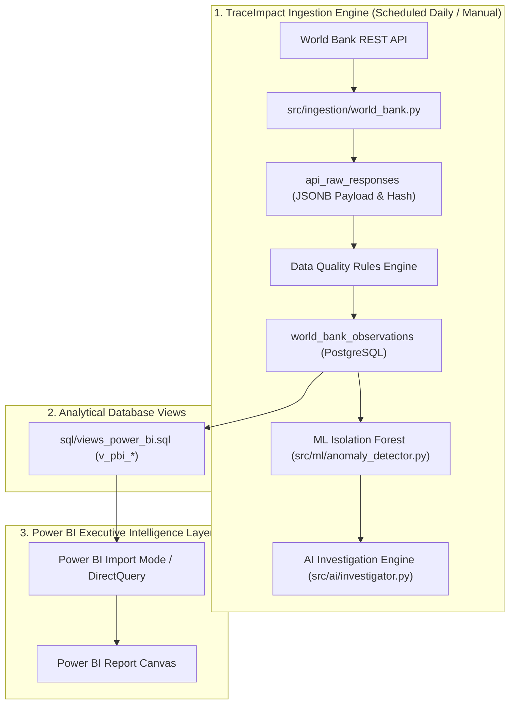

# TraceImpact 2.0 — Power BI Refresh Architecture & Configuration Guide

> **Overview**: This document details the data refresh pipeline, PostgreSQL gateway setup, automated scheduling, connection parameters, and fallback procedures for the TraceImpact 2.0 Power BI layer.

---

## 1. End-to-End Refresh Flow Architecture

Power BI does **not** make direct HTTP calls to external APIs. Instead, all data extraction, rate-limit management, idempotency handling, quality validation, ML scoring, and AI evidence generation are executed by the core TraceImpact 2.0 backend engine. Power BI consumes curated analytical views directly from PostgreSQL.



---

## 2. PostgreSQL Connection Parameters & Setup

To establish connectivity between Power BI Desktop or Power BI Service and the local TraceImpact database:

### Connection Parameters
- **Data Source**: PostgreSQL Database
- **Server**: `localhost` (or `127.0.0.1` / Docker container host)
- **Port**: `5432`
- **Database**: `traceimpact`
- **Data Connectivity Mode**:
  - **Import Mode** (*Recommended for Hackathon / Offline Presentations*): Loads curated data into Power BI in-memory engine for sub-second visual interactions.
  - **DirectQuery Mode** (*Recommended for Production Live Dashboards*): Queries PostgreSQL directly on every slicer selection.

### SQL Statement Query Folding
When importing tables into Power BI Power Query Editor, reference the pre-built analytical views created in `sql/views_power_bi.sql`:

```sql
SELECT * FROM v_pbi_executive_kpis;
SELECT * FROM v_pbi_before_after;
SELECT * FROM v_pbi_data_quality_fact;
SELECT * FROM v_pbi_public_data_explorer;
SELECT * FROM v_pbi_ml_anomaly_fact;
SELECT * FROM v_pbi_ai_investigation_fact;
SELECT * FROM v_pbi_ingestion_monitor;
SELECT * FROM v_pbi_stress_test_benchmarks;
SELECT * FROM v_pbi_end_to_end_lineage;
```

---

## 3. Power BI On-Premises Data Gateway Setup

For cloud-hosted Power BI Service (`app.powerbi.com`) deployments connecting to a local PostgreSQL instance:

1. **Install Gateway**: Download and install the **On-premises Data Gateway (Standard Mode)** on the machine running PostgreSQL.
2. **Configure Gateway**:
   - Gateway Name: `TraceImpact-Local-Gateway`
   - Data Source Type: `PostgreSQL`
   - Server: `localhost`
   - Database: `traceimpact`
   - Authentication Method: `Basic` (PostgreSQL username/password).
3. **Scheduled Refresh Configuration**:
   - Open Dataset Settings in Power BI Service.
   - Map Gateway Connection to `TraceImpact-Local-Gateway`.
   - Enable **Scheduled Refresh**: Set frequency to **Daily** (e.g., 06:00 AM UTC).

---

## 4. On-Demand Refresh via Command Line / Python

To trigger a full data ingestion run and immediately refresh local database views for presentation testing:

```bash
# 1. Trigger automated World Bank ingestion pipeline
python3 src/ingestion/world_bank.py --countries ALL --indicators ALL

# 2. Re-run ML anomaly detection and AI investigation
python3 src/ml/anomaly_detector.py
python3 src/ai/investigator.py

# 3. Verify Power BI analytical views in PostgreSQL
python3 src/power_bi_validator.py
```

---

## 5. Failure Resilience & Database Fallbacks

If PostgreSQL is temporarily unavailable or unreachable during a Power BI refresh attempt:

- **Import Mode Resilience**: Power BI retains the last successfully cached dataset. All report visual pages remain fully functional and interactive using cached metrics.
- **Refresh Error Logging**: If a query fails, Power BI logs the specific ODBC error (e.g., `Connection Refused at 127.0.0.1:5432`).
- **Data Provenance Preservation**: Cached dataset visual KPI cards continue to display explicit `[REAL]`, `[MEASURED]`, `[SIMULATED]`, `[PROJECTED]` provenance tags alongside the timestamp of the last successful refresh (`last_updated_at`).
