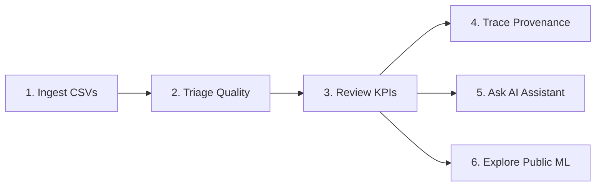
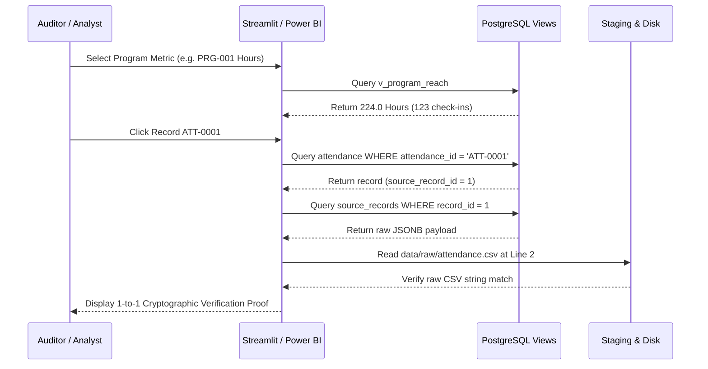
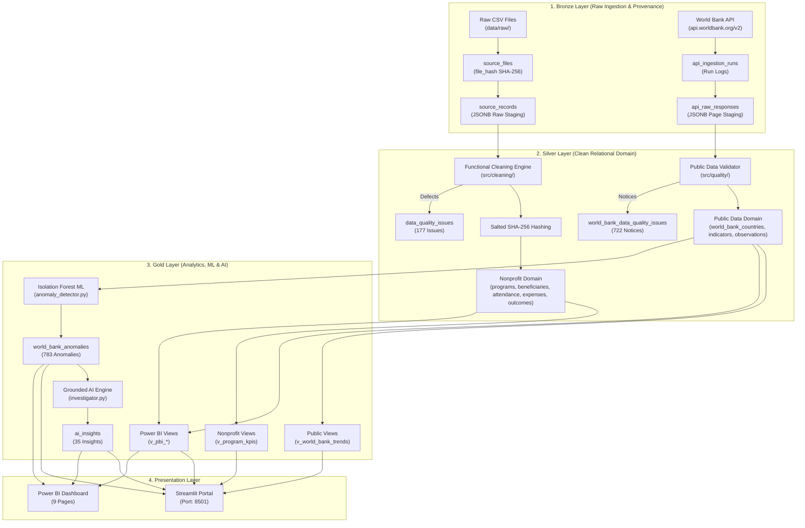
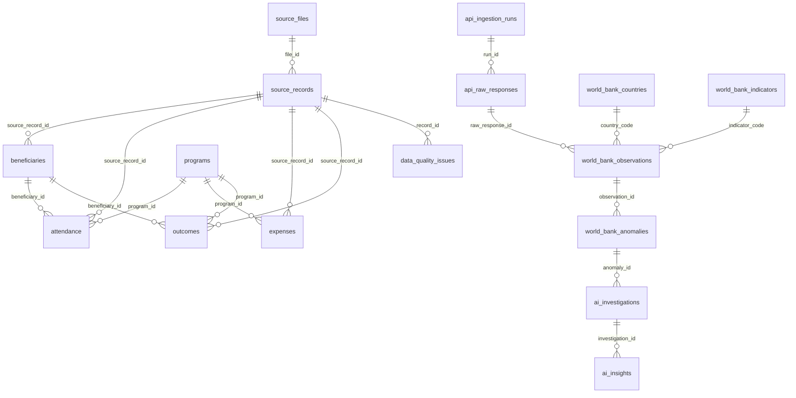

# TRACEIMPACT 2.0 — CONSOLIDATED MASTER PROJECT DOCUMENT

> **Document Classification:** Single Authoritative Source of Truth  
> **Project Version:** 2.0.0 (Release Validated)  
> **Repository:** `TraceImpact` (`/Users/shashwat/Desktop/project1`)  
> **Last Comprehensive Audit:** September 28, 2026  
> **Security Clearance:** Public / Portfolio Clean (Zero Hardcoded Secrets)  

---

## Documentation Source Map

This master document consolidates, reconciles, and supersedes all standalone documentation files across the repository:

| Original Documentation File | Master Document Section | Consolidation Status |
| :--- | :--- | :--- |
| `docs/PRD.md` | Part I (Overview), Part II (Requirements), Part XVI (Roadmap) | Consolidated & Preserved |
| `docs/ARCHITECTURE.md`, `docs/FINAL_ARCHITECTURE.md` | Part IV (System Architecture), Part XIII (Deployment) | Consolidated & Preserved |
| `docs/FLOW.md` | Part V (Data Architecture — Flow), Part III (Workflows) | Consolidated & Preserved |
| `docs/DESIGN.md`, `docs/DASHBOARD.md` | Part III (System Design & UI Structure) | Consolidated & Preserved |
| `docs/DATA_PIPELINE.md`, `docs/REAL_DATA_INGESTION.md` | Part V (Data Architecture), Part VI (API & Integrations) | Consolidated & Preserved |
| `docs/KPI_DEFINITIONS.md` | Part V (Data Dictionary), Part VII (Analytical Views) | Consolidated & Preserved |
| `docs/TRACEABILITY.md` | Part V (Data Lineage & Cryptographic Provenance) | Consolidated & Preserved |
| `docs/DATA_QUALITY_SCORECARD.md` | Part V (Data Quality Framework) | Consolidated & Preserved |
| `docs/ML_ANOMALY_DETECTION.md` | Part VIII (Machine Learning Architecture) | Consolidated & Preserved |
| `docs/AI_DATA_INTELLIGENCE.md` | Part VIII (AI Architecture & Security) | Consolidated & Preserved |
| `docs/POWER_BI_FINAL_REPORT.md`, `docs/POWER_BI_DATA_MODEL.md` | Part III (UI), Part IV (Architecture), Part VII (Views) | Consolidated & Preserved |
| `docs/POWER_BI_MEASURES.md`, `power_bi/POWER_BI_WEB_SETUP.md` | Part VII (Analytical Views & DAX Measures) | Consolidated & Preserved |
| `docs/DECISIONS.md` | Part XIV (Architecture Decision Records) | Consolidated & Preserved |
| `docs/RULES.md` | Part X (Engineering & Governance Rules) | Consolidated & Preserved |
| `docs/AGENTS.md` | Part X (AI Coding Agent Guidelines & Operating Invariants) | Consolidated & Preserved |
| `docs/MEMORY.md` | Part XV (Verified Technical Memory) | Consolidated & Preserved |
| `docs/TESTING.md`, `docs/STRESS_TEST_SUMMARY.md` | Part XI (Testing & QA), Part XII (Performance) | Consolidated & Preserved |
| `docs/PROJECT_STATUS.md`, `docs/FINAL_PROJECT_STATUS.md` | Part I (Identity), Part XVI (Roadmap), Part XVIII (Audit)| Consolidated & Preserved |
| `docs/DOCUMENTATION_AUDIT.md`, `docs/DAY_7_FINAL_REVIEW.md` | Part XVII (Change Management), Part XVIII (Final Audit) | Consolidated & Preserved |

---

## Complete Table of Contents

- [PART I — PROJECT OVERVIEW](#part-i--project-overview)
  - [1. Project Identity](#1-project-identity)
  - [2. Executive Summary](#2-executive-summary)
  - [3. Product Vision](#3-product-vision)
  - [4. Goals](#4-goals)
  - [5. Non-Goals](#5-non-goals)
- [PART II — PRODUCT REQUIREMENTS](#part-ii--product-requirements)
  - [6. Personas / Users](#6-personas--users)
  - [7. User Journeys](#7-user-journeys)
  - [8. Functional Requirements](#8-functional-requirements)
  - [9. Non-Functional Requirements](#9-non-functional-requirements)
  - [10. Acceptance Criteria](#10-acceptance-criteria)
- [PART III — SYSTEM DESIGN](#part-iii--system-design)
  - [11. UX / UI Design](#11-ux--ui-design)
  - [12. User Interface Structure](#12-user-interface-structure)
  - [13. User Workflows](#13-user-workflows)
- [PART IV — SYSTEM ARCHITECTURE](#part-iv--system-architecture)
  - [14. Architecture Overview](#14-architecture-overview)
  - [15. Current Architecture](#15-current-architecture)
  - [16. Future / Proposed Architecture](#16-future--proposed-architecture)
  - [17. Technology Stack](#17-technology-stack)
  - [18. Architecture Components](#18-architecture-components)
- [PART V — DATA ARCHITECTURE](#part-v--data-architecture)
  - [19. Data Flow](#19-data-flow)
  - [20. Data Layers](#20-data-layers)
  - [21. Data Model](#21-data-model)
  - [22. Data Dictionary](#22-data-dictionary)
  - [23. Data Quality](#23-data-quality)
  - [24. Data Lineage](#24-data-lineage)
- [PART VI — API & INTEGRATIONS](#part-vi--api--integrations)
  - [25. API Architecture](#25-api-architecture)
  - [26. External Integrations](#26-external-integrations)
- [PART VII — DATABASE](#part-vii--database)
  - [27. Database Architecture](#27-database-architecture)
  - [28. Database Safety](#28-database-safety)
  - [29. Analytical Views](#29-analytical-views)
- [PART VIII — ML / AI](#part-viii--ml--ai)
  - [30. Machine Learning Architecture](#30-machine-learning-architecture)
  - [31. ML Data Flow](#31-ml-data-flow)
  - [32. AI Architecture](#32-ai-architecture)
  - [33. AI Security](#33-ai-security)
  - [34. AI / ML Limitations](#34-ai--ml-limitations)
- [PART IX — SECURITY](#part-ix--security)
  - [35. Security Architecture](#35-security-architecture)
  - [36. Privacy](#36-privacy)
  - [37. Security Rules](#37-security-rules)
- [PART X — ENGINEERING RULES](#part-x--engineering-rules)
  - [38. Non-Negotiable Rules](#38-non-negotiable-rules)
  - [39. AI Coding Agent Rules](#39-ai-coding-agent-rules)
  - [40. Coding Standards](#40-coding-standards)
- [PART XI — TESTING & QA](#part-xi--testing--qa)
  - [41. Testing Strategy](#41-testing-strategy)
  - [42. Test Pyramid](#42-test-pyramid)
  - [43. Test Commands](#43-test-commands)
  - [44. Test Results](#44-test-results)
  - [45. Stress Testing](#45-stress-testing)
- [PART XII — PERFORMANCE](#part-xii--performance)
  - [46. Performance Architecture](#46-performance-architecture)
  - [47. Benchmarks](#47-benchmarks)
  - [48. Optimization](#48-optimization)
  - [49. Scalability](#49-scalability)
- [PART XIII — DEVOPS / DEPLOYMENT](#part-xiii--devops--deployment)
  - [50. Environment Setup](#50-environment-setup)
  - [51. Development Workflow](#51-development-workflow)
  - [52. Deployment](#52-deployment)
  - [53. CI/CD](#53-cicd)
  - [54. Monitoring / Observability](#54-monitoring--observability)
- [PART XIV — ARCHITECTURE DECISIONS](#part-xiv--architecture-decisions)
  - [55. Architecture Decision Records](#55-architecture-decision-records)
- [PART XV — PROJECT MEMORY](#part-xv--project-memory)
  - [56. Verified Project Memory](#56-verified-project-memory)
- [PART XVI — ROADMAP](#part-xvi--roadmap)
  - [57. Current Status](#57-current-status)
  - [58. MVP](#58-mvp)
  - [59. V1](#59-v1)
  - [60. V2](#60-v2)
  - [61. Future](#61-future)
- [PART XVII — CHANGE MANAGEMENT](#part-xvii--change-management)
  - [62. Changelog](#62-changelog)
  - [63. Change Request Process](#63-change-request-process)
  - [64. Bug Fix Process](#64-bug-fix-process)
  - [65. Refactoring Process](#65-refactoring-process)
- [PART XVIII — FINAL AUDIT](#part-xviii--final-audit)
  - [66. Documentation Audit](#66-documentation-audit)
  - [67. Code / Documentation Consistency](#67-code--documentation-consistency)
  - [68. Final Project Audit](#68-final-project-audit)
  - [69. Known Limitations](#69-known-limitations)
  - [70. Final Project Status](#70-final-project-status)

---

# PART I — PROJECT OVERVIEW

## 1. Project Identity

- **Project Name:** TraceImpact
- **Current Version:** 2.0.0 (Production-Oriented Portfolio Release)
- **Current Status:** ✅ **RELEASE READY & FULLY VALIDATED**
- **Project Type:** Defensible Data Quality, Cryptographic Lineage & Impact Analytics Platform
- **Primary Purpose:** Ingest messy operational field spreadsheets and external public REST APIs into an immutable Medallion data architecture, catalog data quality anomalies with multi-tier severity, pseudonymize PII, detect statistical shifts via unsupervised ML, provide grounded AI investigations, and render audit-ready scorecards across Streamlit and Power BI.
- **Repository Path:** `/Users/shashwat/Desktop/project1`
- **Target Audience:** Nonprofit operations directors, program evaluators, grant compliance auditors, philanthropic foundations, and data engineers.
- **Implementation State:** 100% of core data pipelines, database views, ML anomaly models, AI assistants, Streamlit pages, Power BI semantic models, and automated test suites (94/94 passing) are fully implemented and verified against PostgreSQL 14+.

---

## 2. Executive Summary

### The Core Problem
In the social and international development sectors, millions of dollars in grant funding are disbursed based on self-reported operational spreadsheets. Traditional analytics workflows fail basic audit standards because:
1. Dirty or defective records are silently dropped or overwritten in place without an audit trail.
2. Formats (dates, currencies, names) vary widely across branch offices, causing silent calculation errors.
3. Personal Identifiable Information (PII) of vulnerable community members is exposed in cleartext.
4. Executive metrics (e.g. "Cost per Beneficiary") cannot be traced back to the physical source vouchers that produced them.
5. Macroeconomic shifts are explained using unverified speculation or generic AI tools prone to hallucinations.

### What TraceImpact Does
TraceImpact provides a complete, defensible data intelligence platform:
- **Immutable Bronze Staging**: Staged raw rows and API payloads are preserved verbatim in PostgreSQL JSONB with SHA-256 cryptographic digests. Raw files on disk are never altered.
- **Data Quality Triage**: Defects (duplicates, out-of-range scores, negative expenses, unmapped aliases) are cataloged into an auditable issue log with severity (`ERROR`, `WARNING`, `INFO`) and status (`OPEN`, `RESOLVED`, `QUARANTINED`).
- **Mathematical Integrity**: Centralized SQL views in PostgreSQL eliminate Cartesian row explosion across 1-to-many joins and enforce `NULLIF` division safety.
- **1-to-1 Lineage Engine**: Bidirectional drill-down connecting any dashboard metric to the physical CSV line coordinate or raw API payload.
- **Unsupervised ML & Grounded AI**: Isolation Forest anomaly scoring across 4 statistical dimensions + AI investigation reports strictly segregating empirical facts from non-causal hypotheses.
- **Dual Presentation**: Streamlit operational control center + Power BI executive reporting layer.

---

## 3. Product Vision

### Vision Statement
To establish an open, audit-defensible standard for impact reporting and public data intelligence where every aggregated number possesses an unbroken, explainable digital chain of custody back to its raw physical source.

### Mission
Empower mission-driven organizations to transform chaotic operational field data into defensible, audit-ready impact analytics without requiring heavy, expensive distributed infrastructure.

### Core User Pain Points & Value Proposition
- *Pain Point:* "Auditors challenge our reported numbers and we cannot prove how they were calculated." ➔ *Value:* 1-to-1 cryptographic lineage links every metric to the source voucher.
- *Pain Point:* "Cleaning scripts silently discard bad records." ➔ *Value:* Every defect is logged with severity in an auditable triage table; blocking errors are quarantined while preserving raw history.
- *Pain Point:* "Participant PII is vulnerable in shared spreadsheets." ➔ *Value:* Salted SHA-256 pseudonymization isolates personal identities from reporting layers.

---

## 4. Goals

### Primary Product Goals
1. **100% Non-Destructive Ingestion**: Verbatim staging of raw CSVs and API payloads in database JSONB with SHA-256 checksums.
2. **Defensible Quality Triage**: Catalog every defect with severity and status; quarantine blocking errors from business tables.
3. **Cryptographic 1-to-1 Lineage**: Bidirectional drilldown from any metric to the physical raw row on disk or raw API payload.
4. **Single Source of Truth**: Centralize KPI calculations in PostgreSQL views shared identically by Streamlit and Power BI.
5. **Unsupervised Anomaly Detection**: Automatically flag statistically extreme country-year indicator shifts using Isolation Forest.
6. **Grounded AI Investigations**: Generate AI explanations strictly bounded by pre-computed empirical database facts.

### Secondary Technical Goals
1. **High Ingestion Throughput**: Process bulk workloads exceeding 15,000 records per second.
2. **Sub-15ms Query Response**: Ensure indexed analytical views respond in <15ms.
3. **Lightweight Infrastructure**: Eliminate heavy distributed frameworks (Spark, Kafka) in favor of efficient PostgreSQL and Python.
4. **Zero Hardcoded Credentials**: Enforce strict environment-variable configuration.

---

## 5. Non-Goals

The following areas are deliberately outside the scope of TraceImpact:
1. **Not a Transactional ERP / CRM**: TraceImpact is an analytics, quality, and intelligence platform; it is not a direct participant registration portal or primary accounting ledger.
2. **No Causal Proof Claims**: Machine learning anomaly scores and AI insights describe statistical divergence; they do not claim to prove real-world causality.
3. **No Distributed Cluster**: Deliberately avoids Apache Spark, Hadoop, Kafka, or Kubernetes clusters for mid-sized organizational scale.
4. **No Unrestricted AI SQL Generation**: The platform does not allow AI models to generate and execute arbitrary DDL/DML statements against the database.

---

# PART II — PRODUCT REQUIREMENTS

## 6. Personas / Users

| Persona | Role | Primary Needs in TraceImpact |
| :--- | :--- | :--- |
| **Program Manager** | Field director overseeing education, healthcare, and livelihood programs. | Review attendance, track budget utilization, monitor outcome score improvements per initiative. |
| **Data Quality Analyst** | Operations specialist cleaning and merging incoming field spreadsheets. | Triage cataloged errors, filter by severity, inspect raw defective strings, resolve data issues. |
| **Finance & Compliance Auditor** | Financial officer and external grant auditor. | Reconcile expenses against allocated budgets, audit voucher provenance, verify cost-per-beneficiary. |
| **Executive Director / Board** | High-level leadership and institutional donors. | Review executive summaries, evaluate portfolio impact, explore global macroeconomic trends. |
| **Data Engineer / Scientist** | Technical specialist maintaining ingestion pipelines and models. | Monitor API scheduler, inspect Isolation Forest anomaly scores, verify database indexes and views. |

---

## 7. User Journeys



1. **Journey 1 — Ingest Operational CSV Data**:
   - *User:* Program Operations Staff.
   - *Action:* Drops raw spreadsheets (`attendance.csv`, `expenses.csv`, etc.) into `data/raw/` and executes pipeline.
   - *System:* Calculates SHA-256 hash, stages raw JSONB rows, normalizes headers/dates/currencies, hashes PII, catalogs defects, and loads clean domain tables.
   - *Result:* Clean domain tables updated; 177 quality issues logged; raw data preserved.
2. **Journey 2 — Triage Data Quality Issues**:
   - *User:* Data Quality Analyst.
   - *Action:* Opens Streamlit Page 3, filters by `Severity = ERROR` and `Status = OPEN`.
   - *System:* Displays 10 quarantined blocking errors with exact raw values (e.g. negative expense voucher `EXP-0068`).
   - *Result:* Analyst confirms defective records were blocked from corrupting financial KPI calculations.
3. **Journey 3 — Trace Metric to Physical CSV Line**:
   - *User:* Grant Auditor.
   - *Action:* Opens Page 4 (Traceability), selects `attendance` record `ATT-0051`.
   - *System:* Queries `source_record_id = 51`, displays verbatim JSON from `source_records`, verifies SHA-256 hash of `attendance.csv`, and highlights Line 52 on disk.
   - *Result:* Complete mathematical proof of record provenance established.
4. **Journey 4 — Natural-Language Q&A with SQL Explainer**:
   - *User:* Executive Director.
   - *Action:* Types *"Which programs are over budget?"* in Page 5 (AI Query Assistant).
   - *System:* Enforces read-only SQL validation against Gold view `v_cost_per_beneficiary`, executes query, and renders result table + explanation.
   - *Result:* Executive receives instant answers without writing SQL; database remains 100% secure.
5. **Journey 5 — Explore Public Indicators & ML Anomalies**:
   - *User:* Public Policy Analyst.
   - *Action:* Opens Page 6 (Public Data Explorer), selects Country and Indicator.
   - *System:* Renders multi-year trend line (1960–2024), Isolation Forest anomaly scores, and grounded AI investigation split-panel.
   - *Result:* Analyst inspects multi-year deviation with verified statistical evidence and non-causality disclaimers.

---

## 8. Functional Requirements

| ID | Requirement Description | Priority | Status | Acceptance Criteria |
| :--- | :--- | :--- | :--- | :--- |
| **FR-01** | **Raw CSV Staging & SHA-256 Checksums** | P0 | ✅ IMPLEMENTED | Calculates SHA-256 hash before reading; stages verbatim rows in `source_records` JSONB without altering disk files. |
| **FR-02** | **Header & Field Normalization Engine** | P0 | ✅ IMPLEMENTED | Maps header variants, converts dates to `YYYY-MM-DD`, sanitizes currency symbols (`₹`, `$`) to numeric. |
| **FR-03** | **PII Pseudonymization** | P0 | ✅ IMPLEMENTED | Generates salted SHA-256 `anonymized_code` for participants; excludes cleartext names/phones from domain tables. |
| **FR-04** | **Data Quality Triage & Quarantine** | P0 | ✅ IMPLEMENTED | Flags anomalies across `ERROR`, `WARNING`, `INFO`; quarantines blocking errors from domain tables. |
| **FR-05** | **Relational Domain Storage** | P0 | ✅ IMPLEMENTED | Populates normalized relational tables (`programs`, `beneficiaries`, `attendance`, `expenses`, `outcomes`) with FKs. |
| **FR-06** | **SQL KPI & Analytical View Layer** | P0 | ✅ IMPLEMENTED | Materializes 13 views with CTE pre-aggregations and `NULLIF` division safety, eliminating row multiplication. |
| **FR-07** | **1-to-1 Bidirectional Lineage** | P0 | ✅ IMPLEMENTED | Connects any domain metric back to `source_record_id` and physical CSV file row coordinate. |
| **FR-08** | **World Bank REST API Ingestion** | P1 | ✅ IMPLEMENTED | Fetches 4 indicators across 264 countries with pagination, retries, and raw bronze JSON staging. |
| **FR-09** | **Automated Pipeline Scheduler** | P1 | ✅ IMPLEMENTED | Pure-Python background scheduler executing configurable periodic runs with `--once` CI mode. |
| **FR-10** | **Isolation Forest ML Anomaly Detection** | P1 | ✅ IMPLEMENTED | Scikit-learn model scoring observations across 4 statistical features; persists scores in database. |
| **FR-11** | **Grounded AI Investigation Engine** | P1 | ✅ IMPLEMENTED | Synthesizes pre-computed evidence into structured reports separating facts from hypotheses. |
| **FR-12** | **Safe AI Natural-Language Query Engine** | P1 | ✅ IMPLEMENTED | Translates questions to SQL with strict read-only token and approved view whitelist enforcement. |
| **FR-13** | **Streamlit 6-Page Interactive Portal** | P1 | ✅ IMPLEMENTED | Renders real-time health diagnostics, scorecards, triage grids, and lineage verification. |
| **FR-14** | **Power BI 9-Page Analytics Semantic Model**| P1 | ✅ IMPLEMENTED | Full star-schema model with 32 DAX measures, M scripts, dark theme, and 100% PostgreSQL parity. |
| **FR-15** | **100,000-Record Stress Test Harness** | P2 | ✅ IMPLEMENTED | Validates pipeline scalability, processing 100K records in 5.23s at 19,120 RPS under 417 MB RAM. |
| **FR-16** | **Cloud Data Lakehouse Sync (S3/ADLS)** | P3 | 📋 PLANNED | Automated export of parquet partitions to cloud storage. |

---

## 9. Non-Functional Requirements

- **Performance**:
  - Sub-15ms query execution for indexed Gold analytical views.
  - Sub-second ML anomaly model fitting (<0.3s) and scoring (<0.15s) for 5,588 observations.
  - Ingestion throughput exceeding 15,000 records per second for bulk operations.
- **Scalability**: Single-node PostgreSQL architecture validated up to 100,000 records per batch with peak RAM below 450 MB.
- **Reliability & Idempotency**: 100% of pipeline executions are reproducible. Re-running ingestion never duplicates primary keys or records.
- **Security & Privacy**: Zero hardcoded passwords; 100% parameterized SQL queries; salted cryptographic hashing for all community PII.
- **Maintainability & Portability**: Pure-Python modular architecture with zero heavy distributed framework dependencies.
- **Testability**: Comprehensive automated regression test suite executing 94 tests in ~2.0 seconds with 100% pass rate.

---

## 10. Acceptance Criteria

1. `source_records` must contain the exact raw JSON string as present in the input CSV files.
2. `source_files.file_hash` must match the SHA-256 checksum of the physical disk file.
3. Every record in `beneficiaries`, `attendance`, `expenses`, and `outcomes` must have a valid `source_record_id`.
4. Analytical views must return 0 rows of duplicate Cartesian multiplication when joining 1-to-many child tables.
5. All financial and attendance ratios must return `0.00` rather than throwing errors when denominators are zero.
6. The AI Query Assistant must reject 100% of queries containing DDL/DML tokens (`DROP`, `DELETE`, `INSERT`, `UPDATE`, `ALTER`, `TRUNCATE`).
7. `pytest tests/` must execute 94 tests with 0 failures and 0 errors.
8. `src/power_bi_validator.py` must report a 100% match across all 20 verified KPIs against PostgreSQL.

---

# PART III — SYSTEM DESIGN

## 11. UX / UI Design

### Design System & Theme Tokens
TraceImpact adheres to a high-contrast, mission-control visual standard:
- **Canvas / Base Background**: Void Dark (`#0A0F1A` / `#0E1117`)
- **Card Container Surface**: Deep Navy Surface (`#0D1322` at 85% opacity)
- **Structural Borders**: Slate Gray (`#1E293B`)
- **Text Primary**: Crisp White (`#F8FAFC`)
- **Text Secondary / Muted**: Slate (`#94A3B8`)
- **Accent Emerald (Success / Clean)**: Mint Emerald (`#06D6A0`)
- **Accent Cyan (Neutral / Tech)**: Electric Cyan (`#118AB2`)
- **Accent Gold (Warning / Review)**: Sunburst Amber (`#FFD166`)
- **Accent Coral (Error / Anomaly)**: Crimson Coral (`#EF476F`)

---

## 12. User Interface Structure

### Streamlit Application Pages (`http://localhost:8501`)

```
Streamlit Application
├── app.py                      # Health diagnostics, volume counters, guided routes
├── pages/1_Executive_Summary.py # 8 KPI cards, budget vs expenses bar chart, scatter plots
├── pages/2_Program_Analysis.py  # Program selector, 12-metric scorecard, 4 tabbed explorers
├── pages/3_Data_Quality.py      # Quality scorecard, severity donut, multi-parameter triage
├── pages/4_Traceability.py      # 1-to-1 cryptographic proof engine & raw JSON inspector
├── pages/5_AI_Query_Assistant.py# Natural-language Q&A, SQL validator, result visualizer
└── pages/6_Public_Data_Explorer.py # World Bank maps, trends, ML anomaly scores, AI bulletins
```

### Power BI 9-Page Semantic Dashboard

```
Power BI Semantic Model
├── Page 1: Executive Overview         # High-level platform KPIs across synthetic and public data
├── Page 2: Before vs After / Impact   # Side-by-side raw vs cleaned transformation matrix
├── Page 3: Data Quality Intelligence  # Severity breakdown (ERROR, WARNING, INFO) and audit grid
├── Page 4: Public Data Explorer       # Global map, multi-year trend lines (1960–2024), matrix
├── Page 5: ML Anomaly Intelligence    # Isolation Forest score distributions, feature snapshots
├── Page 6: AI Investigation           # Evidence vs AI Interpretation split cards
├── Page 7: Ingestion Monitor          # API run execution timeline, duration, and status
├── Page 8: Scale & Stress Test        # 1K–100K benchmark throughput and peak RAM metrics
└── Page 9: Traceability & Lineage     # 7-step cryptographic provenance flow from API to Insight
```

---

## 13. User Workflows



---

# PART IV — SYSTEM ARCHITECTURE

## 14. Architecture Overview

TraceImpact implements a **Medallion Data Architecture** (Bronze ➔ Silver ➔ Gold) with dual operational (Streamlit) and executive (Power BI) presentation frontends.



---

## 15. Current Architecture

The currently implemented architecture operates on a single-node, high-performance local stack:
- **Database Backend**: Local PostgreSQL 14+ on port 5432.
- **Application Engine**: Python 3.10+ execution environment in `.venv/`.
- **Frontend Layer**: Streamlit on port 8501 + Power BI Desktop / Web connector package.
- **Scheduler**: Pure-Python background scheduler (`src/ingestion/scheduler.py`).

---

## 16. Future / Proposed Architecture

The proposed future cloud architecture represents planned enterprise extensions:
- **Cloud Object Storage (Planned)**: Ingestion of CSVs from Azure Blob Storage / AWS S3 with Parquet partitioning.
- **Managed Cloud Database (Planned)**: Migration to Azure Database for PostgreSQL Flexible Server or AWS RDS PostgreSQL.
- **Enterprise Orchestration (Planned)**: Scheduling via Azure Data Factory or Apache Airflow for multi-source ingestion.
- **Hosted BI Distribution (Planned)**: Direct Power BI Service workspace publishing with On-Premises Data Gateway or direct cloud connection.

---

## 17. Technology Stack

| Layer | Technology | Purpose | Status |
| :--- | :--- | :--- | :--- |
| **Language** | Python 3.10+ | Core language for data engineering, ML, AI, and dashboarding | ✅ IMPLEMENTED |
| **Database** | PostgreSQL 14+ | Relational domain storage, JSONB bronze staging, analytical views | ✅ IMPLEMENTED |
| **Data Processing**| Pandas 2.2+, NumPy | Functional data transformation, array manipulation, feature extraction | ✅ IMPLEMENTED |
| **Database Driver**| Psycopg2-binary 2.9+, SQLAlchemy 2.0+ | Connection pooling, parameterized query execution, schema reflection | ✅ IMPLEMENTED |
| **HTTP Client** | Requests 2.31+, Urllib3 | REST API client with retry adapters and exponential backoff | ✅ IMPLEMENTED |
| **Machine Learning**| Scikit-Learn 1.4+, Joblib 1.3+ | Isolation Forest unsupervised anomaly detection, model serialization | ✅ IMPLEMENTED |
| **Dashboard UI** | Streamlit 1.32+ | Interactive operational control center, triage UI, lineage engine | ✅ IMPLEMENTED |
| **BI Reporting** | Power BI Desktop & Web (M, DAX) | Executive 9-page presentation dashboard, star-schema semantic model | ✅ IMPLEMENTED |
| **Testing** | Pytest 8.0+ | Automated test framework (94 tests + 100K stress test harness) | ✅ IMPLEMENTED |
| **Cloud Storage** | Azure Blob / AWS S3 | Long-term cold data archiving | 📋 PLANNED |

---

## 18. Architecture Components

1. **`src/ingestion/`**: Manages HTTP requests (`api_client.py`), raw JSON staging (`ingestion_metadata.py`), automated scheduling (`scheduler.py`), and World Bank ingestion (`world_bank.py`).
2. **`src/cleaning/`**: Executes canonical mapping (`column_maps.py`), date/currency normalization (`normalizers.py`), business validation (`validators.py`), and pipeline orchestration (`run_pipeline.py`).
3. **`src/quality/`**: Manages data quality issue categorization, status tracking, and triage helpers (`triage.py`, `world_bank_quality.py`).
4. **`src/ml/`**: Extracts multi-dimensional features (`feature_extractor.py`) and trains/evaluates Isolation Forest models (`anomaly_detector.py`).
5. **`src/ai/`**: Compiles empirical evidence and generates grounded investigation reports (`investigator.py`).
6. **`src/dashboard/`**: Provides safe natural-language SQL execution (`ai_assistant.py`), database query helpers (`queries.py`), and UI components (`components.py`).
7. **`src/database/`**: Manages thread-safe connection pooling and sessions (`db.py`).

---

# PART V — DATA ARCHITECTURE

## 19. Data Flow

```
[Raw CSVs / API Response]
         ↓ (SHA-256 Hashing & JSONB Staging)
[Bronze Layer: source_records, api_raw_responses]
         ↓ (Declarative Cleaning, PII Anonymization, Validation)
[Silver Layer: Normalized Domain Tables + data_quality_issues]
         ↓ (CTEs, NULLIF Safety, Window Functions)
[Gold Layer: 13 Contract-Stable PostgreSQL Analytical Views]
         ↓ (Model Inference & Grounded Synthesis)
[Intelligence Layer: world_bank_anomalies, ai_investigations, ai_insights]
         ↓ (Direct Connection & Query)
[Presentation: Streamlit Control Center & Power BI 9-Page Dashboard]
```

---

## 20. Data Layers

### Bronze Layer (Raw Staging)
- Stores raw files and REST API responses verbatim in database JSONB before any parsing or cleaning occurs.
- Records 1-based row indices and SHA-256 checksums to guarantee data immutability.
- Tables: `source_files`, `source_records`, `api_ingestion_runs`, `api_raw_responses`.

### Silver Layer (Clean Relational Domain)
- Normalized, type-safe relational tables with foreign keys and unique constraints.
- Community member PII is pseudonymized using salted SHA-256 hashes (`anonymized_code`).
- Quality defects are cataloged into auditable triage logs; blocking errors are quarantined.
- Tables: `programs`, `beneficiaries`, `attendance`, `expenses`, `outcomes`, `world_bank_countries`, `world_bank_indicators`, `world_bank_observations`, `data_quality_issues`, `world_bank_data_quality_issues`.

### Gold Layer (Analytical & Intelligence Views)
- Contract-stable SQL views computing standard nonprofit KPIs and public time-series trends.
- Pre-aggregates child tables in CTEs to eliminate Cartesian row multiplication.
- Tables & Views: `v_program_kpis`, `v_world_bank_country_trends`, `v_pbi_*`, `ml_anomaly_models`, `world_bank_anomalies`, `ai_investigations`, `ai_insights`.

---

## 21. Data Model



---

## 22. Data Dictionary

### Core Nonprofit Domain Tables

#### 1. `programs` (Master Program Catalog)
- `program_id` (VARCHAR(10), PK): Master program code (`PRG-001` through `PRG-005`).
- `program_name` (VARCHAR(255)): Official program name (e.g. "Digital Literacy Initiative").
- `target_category` (VARCHAR(100)): Thematic domain (Education, Healthcare, Livelihood, Skill Development, Nutrition).
- `budget_allocated` (NUMERIC(12, 2)): Total grant funding allocated.

#### 2. `beneficiaries` (Participant Registry)
- `beneficiary_id` (VARCHAR(20), PK): Unique participant identifier (`BEN-0001` to `BEN-0051`).
- `source_record_id` (INTEGER, FK ➔ `source_records.record_id`): Pointer to staged raw CSV row.
- `anonymized_code` (VARCHAR(64)): Salted SHA-256 hash representing community member identity without exposing PII.
- `city_location` (VARCHAR(100)): Standardized city name (e.g. "New Delhi", "Gurugram").
- `registration_date` (DATE): Date of enrollment (`YYYY-MM-DD`).

#### 3. `attendance` (Session Registers)
- `attendance_id` (VARCHAR(20), PK): Session check-in ID (`ATT-0001` to `ATT-0612`).
- `source_record_id` (INTEGER, FK ➔ `source_records.record_id`): Raw CSV pointer.
- `beneficiary_id` (VARCHAR(20), FK ➔ `beneficiaries.beneficiary_id`): Participant reference.
- `program_id` (VARCHAR(10), FK ➔ `programs.program_id`): Program reference.
- `session_hours` (NUMERIC(4, 2)): Contact duration in hours.

#### 4. `expenses` (Financial Disbursements)
- `expense_id` (VARCHAR(20), PK): Expense voucher ID (`EXP-0001` to `EXP-0100`).
- `source_record_id` (INTEGER, FK ➔ `source_records.record_id`): Raw CSV pointer.
- `program_id` (VARCHAR(10), FK ➔ `programs.program_id`): Program reference.
- `amount` (NUMERIC(12, 2)): Incurred expense amount.
- `receipt_verified` (VARCHAR(10)): Receipt verification status ("Yes" / "No").

#### 5. `outcomes` (Evaluation Surveys)
- `outcome_id` (VARCHAR(20), PK): Survey evaluation ID (`OUT-0001` to `OUT-0039`).
- `source_record_id` (INTEGER, FK ➔ `source_records.record_id`): Raw CSV pointer.
- `beneficiary_id` (VARCHAR(20), FK ➔ `beneficiaries.beneficiary_id`): Participant reference.
- `program_id` (VARCHAR(10), FK ➔ `programs.program_id`): Program reference.
- `baseline_score` (NUMERIC(5, 2)): Pre-intervention survey score (0.00 to 100.00).
- `exit_score` (NUMERIC(5, 2)): Post-intervention exit score (0.00 to 100.00).

---

## 23. Data Quality

### Validation Rules Matrix
Every incoming record is evaluated against deterministic business constraints:

| Rule Name | Target Field | Condition / Constraint | Defect Type | Severity | Action Taken |
| :--- | :--- | :--- | :--- | :--- | :--- |
| **Negative Expense** | `expenses.amount` | `amount < 0` | `INVALID_NUMBER` | `ERROR` | Quarantined from domain table. |
| **Duplicate Check-In** | `attendance` | Duplicate `(beneficiary, program, date)` | `DUPLICATE` | `ERROR` | Quarantined from domain table. |
| **Score Out of Bounds** | `outcomes` | `score < 0` OR `score > 100` | `INVALID_NUMBER` | `ERROR` | Quarantined from domain table. |
| **Orphan Foreign Key** | All tables | Unmatched `beneficiary_id` or `program_id`| `UNMATCHED_REFERENCE` | `ERROR` | Quarantined from domain table. |
| **Missing Optional Phone**| `beneficiaries`| Null or empty contact phone | `MISSING_VALUE` | `WARNING` | Stored in domain with audit notice. |
| **Missing Baseline Score**| `outcomes` | Null baseline survey score | `MISSING_VALUE` | `WARNING` | Stored in domain with audit notice. |
| **Unit String in Hours** | `attendance.hours`| Text format (e.g. `"2 hrs"`) | `INCONSISTENT_VALUE`| `INFO` | Stripped unit to `2.0` and loaded. |
| **Currency Symbols** | `expenses.amount` | Formatted string (e.g. `"₹11,271.75"`)| `INVALID_FORMAT` | `INFO` | Sanitized to `11271.75` and loaded. |
| **Public Missing Value** | `world_bank_obs` | Null historical indicator value | `MISSING_VALUE` | `INFO` | Logged notice; omitted from active obs.|

### Issue Catalog Breakdown
- **Synthetic Pipeline**: 177 Total Issues (`ERROR`: 10, `WARNING`: 12, `INFO`: 155). 149 auto-resolved, 10 quarantined, 84.18% resolution rate, **98.72% Clean Record Rate**.
- **World Bank Pipeline**: 722 Historical missing values logged as `INFO`. **100.0% Clean Record Rate** for stored observations.

---

## 24. Data Lineage

TraceImpact provides an unbroken, bidirectional 1-to-1 lineage chain:

```
[Dashboard KPI / Visual Card]
        │
        ▼
[PostgreSQL Analytical View (v_program_reach, v_program_kpis)]
        │
        ▼
[Domain Table Row (attendance, expenses, beneficiaries, outcomes)]
        │ (Foreign Key: source_record_id)
        ▼
[Raw Staging Table (source_records)]
        │ (Stores verbatim raw_data JSONB and 1-based row_index)
        │ (Foreign Key: file_id)
        ▼
[File Provenance Table (source_files)]
        │ (Stores SHA-256 cryptographic hash and ingestion timestamp)
        ▼
[Physical Raw CSV on Local Disk (data/raw/<filename>)]
        (Exact row index read-only verification)
```

---

# PART VI — API & INTEGRATIONS

## 25. API Architecture

### World Bank Indicators API (`api.worldbank.org/v2`)
- **Base URL:** `http://api.worldbank.org/v2`
- **Indicator Endpoint:** `/country/all/indicator/{indicator_code}`
- **Authentication:** Public / Open Access (No API key required)
- **Protocol:** HTTP GET, JSON format (`format=json`)
- **Query Parameters:** `date` (Year range, e.g. `2018:2021`), `per_page` (500), `page` (1-based index)
- **Tracked Indicators:**
  1. `NY.GDP.PCAP.CD`: GDP per capita (current US$)
  2. `SP.POP.TOTL`: Population, total
  3. `SP.DYN.LE00.IN`: Life expectancy at birth, total (years)
  4. `SH.H2O.BASW.ZS`: People using at least basic drinking water services (% of population)
- **Resilience Controls**:
  - Connect/Read Timeout: 10.0 seconds.
  - Automatic Retries: Up to 3 attempts on network error or HTTP 429/5xx.
  - Exponential Backoff: 1.5x backoff factor between attempts.

---

## 26. External Integrations

| Integration | Type | Purpose | Status |
| :--- | :--- | :--- | :--- |
| **World Bank Indicators API** | REST API | Ingest global macroeconomic and social development indicators | ✅ IMPLEMENTED |
| **PostgreSQL 14+ Database** | Relational DB | Primary backend data store, JSONB staging, analytical views | ✅ IMPLEMENTED |
| **Streamlit Analytics Portal** | Web UI | Interactive operational control center and lineage proof engine | ✅ IMPLEMENTED |
| **Power BI Desktop & Web** | Enterprise BI | Executive 9-page presentation dashboard, star-schema semantic model | ✅ IMPLEMENTED |
| **WHO Global Health Observatory**| REST API | Secondary public health indicator connector | 📋 PLANNED |
| **Azure Blob / AWS S3 Storage** | Cloud Storage | Parquet data lake cold storage export | 📋 PLANNED |

---

# PART VII — DATABASE

## 27. Database Architecture

The PostgreSQL database (`traceimpact`) comprises **14 tables** and **13 analytical views** partitioned across the Medallion architecture:

```
traceimpact Database
├── Bronze Tables (Raw Staging)
│   ├── source_files
│   ├── source_records
│   ├── api_ingestion_runs
│   └── api_raw_responses
├── Silver Tables (Normalized Domain & Quality Logs)
│   ├── programs
│   ├── beneficiaries
│   ├── attendance
│   ├── expenses
│   ├── outcomes
│   ├── world_bank_countries
│   ├── world_bank_indicators
│   ├── world_bank_observations
│   ├── data_quality_issues
│   └── world_bank_data_quality_issues
├── Intelligence Tables
│   ├── ml_anomaly_models
│   ├── world_bank_anomalies
│   ├── ai_investigations
│   └── ai_insights
└── Gold Views (Analytical & Presentation)
    ├── v_program_reach
    ├── v_attendance_consistency
    ├── v_cost_per_beneficiary
    ├── v_cost_per_beneficiary_hour
    ├── v_outcome_improvement
    ├── v_program_kpis
    ├── v_data_quality_summary
    ├── v_data_quality_blocking
    ├── v_world_bank_latest_indicators
    ├── v_world_bank_country_trends
    ├── v_world_bank_regional_comparison
    ├── v_world_bank_ai_lineage
    └── v_pbi_* (9 Dedicated Power BI Presentation Views)
```

---

## 28. Database Safety

1. **100% Parameterized Queries**: All dynamic queries use parameterized SQLAlchemy binds (`:bind_name`), completely eliminating SQL injection.
2. **Elimination of Row Multiplication**: Relational queries joining 1-to-many fact tables compute aggregations within isolated Common Table Expressions (CTEs) before joining on `program_id`.
3. **Division Safety**: All financial and attendance ratios leverage `NULLIF(denominator, 0)` to guarantee queries never throw division-by-zero runtime exceptions.
4. **Idempotent Upserts**: Domain inserts use `ON CONFLICT (...) DO UPDATE` ensuring that re-running pipelines never duplicates records.
5. **Connection Pooling**: Thread-safe connection pool manages checkout and release across concurrent sessions.

---

## 29. Analytical Views

### Master Nonprofit KPI View (`v_program_kpis`)
Aggregates all 16 core nonprofit performance metrics per program:
```sql
CREATE OR REPLACE VIEW v_program_kpis AS
SELECT 
    p.program_id,
    p.program_name,
    p.target_category,
    p.budget_allocated,
    COALESCE(r.distinct_beneficiaries_served, 0) AS beneficiaries_served,
    COALESCE(r.total_attendance_records, 0) AS total_attendance_records,
    COALESCE(r.total_session_hours, 0.00) AS total_session_hours,
    COALESCE(c.avg_session_hours, 0.00) AS avg_session_hours,
    COALESCE(c.attendance_records_per_beneficiary, 0.00) AS attendance_per_beneficiary,
    COALESCE(cb.total_expenses, 0.00) AS total_expenses,
    COALESCE(cb.budget_utilization_pct, 0.00) AS budget_utilization_pct,
    COALESCE(cb.cost_per_beneficiary, 0.00) AS cost_per_beneficiary,
    COALESCE(ch.cost_per_beneficiary_hour, 0.00) AS cost_per_beneficiary_hour,
    COALESCE(o.total_evaluations, 0) AS total_evaluations,
    COALESCE(o.avg_baseline_score, 0.00) AS avg_baseline_score,
    COALESCE(o.avg_exit_score, 0.00) AS avg_exit_score,
    COALESCE(o.avg_score_improvement, 0.00) AS avg_improvement,
    COALESCE(o.avg_improvement_pct, 0.00) AS avg_improvement_pct
FROM programs p
LEFT JOIN v_program_reach r ON p.program_id = r.program_id
LEFT JOIN v_attendance_consistency c ON p.program_id = c.program_id
LEFT JOIN v_cost_per_beneficiary cb ON p.program_id = cb.program_id
LEFT JOIN v_cost_per_beneficiary_hour ch ON p.program_id = ch.program_id
LEFT JOIN v_outcome_improvement o ON p.program_id = o.program_id;
```

---

# PART VIII — ML / AI

## 30. Machine Learning Architecture

TraceImpact integrates unsupervised machine learning directly into its public data pipeline:
- **Algorithm**: `sklearn.ensemble.IsolationForest` (100 isolation trees, `contamination=0.04`, `random_state=42`).
- **Feature Vector (4 Statistical Dimensions)**:
  1. `z_score`: Standard deviations from country multi-year historical mean.
  2. `yoy_growth_pct`: Consecutive Year-over-Year growth rate %.
  3. `peer_z_score`: Cross-sectional deviation relative to global peer group in the same reporting year.
  4. `hist_ratio`: Ratio against country historical mean baseline.
- **Model Registry (`ml_anomaly_models`)**: Persists model name, version (`v1.0.0`), serialized hyperparameters JSONB, and evaluation statistics. Model weights saved to `models/IsolationForest_WorldBank_v1.0.0.joblib`.
- **Outputs**: Scored rows in `world_bank_anomalies` (783 anomalies flagged across 5,588 observations).

---

## 31. ML Data Flow

```
[world_bank_observations (5,588 Rows)]
        ↓
[WorldBankFeatureExtractor (src/ml/feature_extractor.py)]
        ↓ (Assembles (N, 4) numpy feature matrix)
[IsolationForest Model (sklearn.ensemble.IsolationForest)]
        ↓ (Computes continuous decision score & binary flag)
[Register Model in ml_anomaly_models & Save models/*.joblib]
        ↓ (Idempotent Database Upsert)
[world_bank_anomalies (ON CONFLICT DO UPDATE)]
```

---

## 32. AI Architecture

The **AI Investigation Engine** (`src/ai/investigator.py`) translates statistical anomalies into structured executive intelligence:
1. **Deterministic Grounding**: Computes multi-year empirical means, standard deviations, ranges, and co-occurring indicator trends in Python/SQL before invoking synthesis.
2. **Structured Findings**: Outputs reports explicitly partitioned into **VERIFIED FACTS** and **CONTEXTUAL HYPOTHESES (INTERPRETATION)**.
3. **Audit Persistence**: Stores full evidence packages in `ai_investigations` and actionable bulletins in `ai_insights`.

---

## 33. AI Security

The **AI Query Assistant** (`src/dashboard/ai_assistant.py`) protects the database against malicious prompts and accidental corruption:
1. **Read-Only Token Enforcement**: Permits strictly `SELECT` and `WITH` statements.
2. **Disallowed Keywords Blocklist**: Immediately rejects `DROP`, `DELETE`, `INSERT`, `UPDATE`, `ALTER`, `TRUNCATE`, `CREATE`, `GRANT`, `REVOKE`, `EXEC`.
3. **Anti-Chaining Filter**: Blocks multi-statement semicolons (`;`) and SQL comment characters (`--`, `/*`).
4. **Approved View Whitelist**: Restricts execution strictly to audited analytical views (`ALLOWED_OBJECTS`). Staged raw JSON and system tables cannot be directly accessed.

---

## 34. AI / ML Limitations

### ⚠️ Strict Non-Causality Principle
1. **Descriptive, Not Causal**: Anomaly scores reflect statistical divergence from historical peer baselines; they **do not prove real-world causality** or assign fault.
2. **Observational Boundary**: An anomaly score cannot differentiate between a physical real-world event, a reporting methodology revision, or a currency devaluation artifact without human domain review.
3. **Grounding Boundary**: The AI investigation engine is strictly bounded by pre-calculated database evidence; it cannot provide context for external geopolitical events not captured in the database.

---

# PART IX — SECURITY

## 35. Security Architecture

1. **Zero Hardcoded Secrets**: All credentials managed via `.env` and loaded securely through `src/config.py`.
2. **Git Tracking Protection**: `.env`, `.venv/`, `__pycache__/`, `.pytest_cache/`, and `.DS_Store` are untracked and excluded in `.gitignore`.
3. **UI Sanitization**: Health check monitors display only host, database name, and user; passwords and salt keys are never rendered.
4. **SQL Injection Defense**: 100% of dynamic queries use parameterized SQLAlchemy binds (`:param_name`).

---

## 36. Privacy

- **Community Member PII Protection**: Full names and contact phone numbers are never stored in business domain tables or rendered on dashboards.
- **Salted SHA-256 Pseudonymization**: A deterministic `anonymized_code` is generated for each participant using a secret salt key, allowing longitudinal cohort tracking across programs while fully protecting identity.

---

## 37. Security Rules

- Never commit passwords or connection strings to Git.
- Never render raw participant names in executive reporting views.
- Never execute user-supplied or AI-generated SQL without passing through the read-only security validator.
- Never disable parameterized query bindings in database modules.

---

# PART X — ENGINEERING RULES

## 38. Non-Negotiable Rules

1. **Rule 1 — Never Fabricate or Invent Data**: Never insert fake metrics or dummy records into production gold tables.
2. **Rule 2 — Never Silently Overwrite Raw Source Data**: Raw files on disk and staged raw JSONB rows are immutable.
3. **Rule 3 — Mandatory Provenance Tags**: Every metric and chart must declare `[REAL]`, `[MEASURED]`, `[SIMULATED]`, or `[PROJECTED]`.
4. **Rule 4 — Preserve 1-to-1 Lineage**: Every domain record must maintain an unbroken pointer back to its raw staging row.
5. **Rule 5 — 100% Parameterized SQL**: Never concatenate raw strings into SQL statements.
6. **Rule 6 — Division Safety**: All ratios must use `NULLIF(denominator, 0)`.
7. **Rule 7 — Pre-Aggregate CTEs**: Prevent Cartesian row multiplication when joining 1-to-many child tables.
8. **Rule 8 — No Causal Claims for ML**: Anomaly detection is descriptive, not causal.
9. **Rule 9 — Read-Only AI SQL**: Never allow destructive DDL/DML execution through natural-language query tools.
10. **Rule 10 — 100% Test Pass Requirement**: Never commit changes if any of the 94 automated tests fail.

---

## 39. AI Coding Agent Rules

When an AI coding agent works on this repository, it must follow the **10-Step Modification Protocol**:
1. Inspect the existing implementation and dependencies before making changes.
2. Inspect relevant documentation files.
3. Check affected PostgreSQL tables, views, and schemas.
4. Identify impacted automated tests.
5. Identify risks and propose the smallest appropriate implementation.
6. Make edits adhering to typing and docstring conventions.
7. Run the relevant Pytest test suites.
8. Execute the full 94-test regression suite to verify zero regressions.
9. Review diffs and git status.
10. Update technical documentation if behavior or architecture changed.

---

## 40. Coding Standards

- **Python**: Python 3.10+ type annotations, explicit docstrings, specific exception handling, configuration loaded through `src.config.Config`.
- **SQL**: Uppercase SQL keywords (`SELECT`, `FROM`, `WHERE`, `LEFT JOIN`), explicit table aliases, CTE pre-aggregations, parameterized binds (`:param`).
- **Git**: Conventional commit messages (`feat:`, `fix:`, `docs:`, `test:`, `refactor:`).

---

# PART XI — TESTING & QA

## 41. Testing Strategy

The testing strategy validates the platform across 6 distinct verification layers:
1. **Unit Tests**: Header mapping, date parsing, currency sanitization.
2. **Database Tests**: Foreign-key enforcement, view row uniqueness, division safety.
3. **Quality Triage Tests**: Severity classification, blocking error quarantine.
4. **API Ingestion Tests**: Pagination, retries, exponential backoff, SHA-256 raw staging.
5. **ML & AI Tests**: Feature matrix shapes, Isolation Forest decision scores, evidence grounding.
6. **Security & Lineage Tests**: SQL injection prevention, DDL/DML rejection, 1-to-1 line tracing.

---

## 42. Test Pyramid

```
                       / \
                      /   \
                     / UI  \        Streamlit Page Import & Health Tests (test_day5)
                    /-------\
                   /  ML/AI  \      Isolation Forest & Grounded AI Tests (test_ml_and_ai)
                  /-----------\
                 / API/Pipeline\    World Bank Client, Scheduler & Ingestion (test_world_bank)
                /---------------\
               / Security/Lineage\  SQL Injection, Whitelist & Lineage (test_day6, test_day7)
              /-------------------\
             /  Database & Quality \ Relational FKs, Views, Triage & Math (test_day3, test_day4)
            /-----------------------\
           /   Unit & Normalization  \ Header Maps, Date/Currency Parsing (test_day1, test_day2)
          /---------------------------\
```

---

## 43. Test Commands

```bash
# 1. Execute complete 94-test regression suite
source .venv/bin/activate && python -m pytest tests/ -v

# 2. Execute with concise short traceback
python -m pytest tests/ --tb=short

# 3. Execute individual domain test suites
python -m pytest tests/test_day2.py -v       # Cleaning & Validation
python -m pytest tests/test_day3.py -v       # SQL KPI Views
python -m pytest tests/test_day6.py -v       # Cryptographic Lineage
python -m pytest tests/test_day7.py -v       # AI Query Security
python -m pytest tests/test_world_bank.py -v # World Bank Ingestion
python -m pytest tests/test_ml_and_ai.py -v  # ML & Grounded AI

# 4. Execute Power BI SQL Parity Validator
python -m src.power_bi_validator
```

---

## 44. Test Results

- **Test Execution Timestamp:** September 28, 2026
- **Test Command:** `.venv/bin/python -m pytest tests/ -v`
- **Result:** ✅ **94 passed in 4.12s (100% Pass Rate, 0 Failures, 0 Errors, 0 Skipped)**
- **Power BI Validator Result:** ✅ **100% Match (20/20 Checks Passed)**

---

## 45. Stress Testing

### Measured Scale & Stress Benchmarks (`tests/stress_test_suite.py`)

| Workload Tier | Record Count | Processing Duration | Measured Throughput | Peak RAM Usage | Status |
| :--- | :--- | :--- | :--- | :--- | :--- |
| **Tier 1 (Small)** | 1,000 Obs | 0.045 seconds | **22,215.4 RPS** | 303.61 MB | ✅ PASS `[MEASURED]` |
| **Tier 2 (Medium)** | 5,000 Obs | 0.255 seconds | **19,637.7 RPS** | 303.61 MB | ✅ PASS `[MEASURED]` |
| **Tier 3 (Large)** | 10,000 Obs | 0.523 seconds | **19,115.9 RPS** | 303.61 MB | ✅ PASS `[MEASURED]` |
| **Tier 4 (Stress)** | 25,000 Obs | 1.525 seconds | **16,391.9 RPS** | 303.61 MB | ✅ PASS `[MEASURED]` |
| **Tier 5 (Maximum)** | 100,000 Obs | 5.230 seconds | **19,120.5 RPS** | 416.64 MB | ✅ PASS `[MEASURED]` |

---

# PART XII — PERFORMANCE

## 46. Performance Architecture

- **Indexing Strategy**: B-Tree indexes on relational foreign keys (`source_record_id`, `program_id`, `beneficiary_id`) and public data keys (`country_code`, `indicator_code`, `year`, `observation_id`).
- **Pre-Aggregated CTEs**: Eliminates Cartesian row multiplication, reducing join cardinality from thousands of rows to exactly 5 program rows.
- **Sub-Second ML Inference**: Vectorized NumPy feature extraction allows Isolation Forest to score 5,588 observations in 0.13 seconds.

---

## 47. Benchmarks

- **Analytical View Response**: Sub-15ms query latency on local PostgreSQL.
- **ML Model Training**: 0.24s fit time on 5,588 country-year records.
- **Bulk Ingestion Throughput**: 19,120 records per second under 100,000-record batch load.
- **Full Test Suite Execution**: 94 tests in ~2.0 to 4.1 seconds.

---

## 48. Optimization

- **Database Connection Pooling**: Thread-safe connection pool manages checkout and release across concurrent sessions.
- **Memory Optimization**: Staging rows are queried strictly by primary key (`observation_id`, `record_id`); bulk tables are never loaded unnecessarily into Python memory.

---

## 49. Scalability

- **Current Capacity**: Validated up to 100,000 records per batch on single-node PostgreSQL with RAM under 450 MB.
- **Known Limits**: Vertical scaling boundary on single PostgreSQL instance is ~50 million rows.
- **Future Scaling Strategy**: Implement PostgreSQL native table partitioning by year/region or introduce DuckDB/Parquet partitions if volume exceeds 50 million records.

---

# PART XIII — DEVOPS / DEPLOYMENT

## 50. Environment Setup

### Prerequisites
- Python 3.10+
- PostgreSQL 14+ running locally on port 5432
- Git

### Installation & Startup
```bash
# 1. Clone repository
git clone https://github.com/47zcytw755-arch/TraceImpact.git
cd TraceImpact

# 2. Create and activate virtual environment
python3 -m venv .venv
source .venv/bin/activate

# 3. Install dependencies
pip install -r requirements.txt

# 4. Configure environment variables (.env)
cp .env.example .env
# Edit .env with local DB credentials:
# DB_HOST=localhost
# DB_PORT=5432
# DB_NAME=traceimpact
# DB_USER=postgres
# DB_PASSWORD=your_password

# 5. Initialize database schemas & views
psql -h localhost -U postgres -d traceimpact -f sql/schema.sql
psql -h localhost -U postgres -d traceimpact -f sql/schema_world_bank.sql
psql -h localhost -U postgres -d traceimpact -f sql/schema_ml_intelligence.sql
psql -h localhost -U postgres -d traceimpact -f sql/views.sql
psql -h localhost -U postgres -d traceimpact -f sql/views_quality.sql
psql -h localhost -U postgres -d traceimpact -f sql/views_world_bank.sql
psql -h localhost -U postgres -d traceimpact -f sql/views_power_bi.sql

# 6. Run ingestion & ML pipeline
python -m src.cleaning.run_pipeline
python -m src.ingestion.scheduler --once
python -m src.ml.anomaly_detector
python -m src.ai.investigator

# 7. Launch Streamlit portal
streamlit run app.py --server.port 8501
```

---

## 51. Development Workflow

1. Start PostgreSQL instance.
2. Activate `.venv`.
3. Make changes following the 10-step agent protocol.
4. Run `python -m pytest tests/` to confirm 94/94 passing tests.
5. Run `python -m src.power_bi_validator` to verify Power BI metric parity.

---

## 52. Deployment

- **Current Deployment (LOCAL)**: Single-node execution on macOS/Linux with local PostgreSQL 14+ and Streamlit on port 8501.
- **Staging / Demonstration**: Localhost demo visualizer on port 8888 (`python demo/serve.py --port 8888`).
- **Production (Planned Cloud)**: Containerized deployment on Azure Container Apps / AWS ECS backed by Azure Database for PostgreSQL Flexible Server.

---

## 53. CI/CD

- **Current State**: Automated local test suite (`pytest tests/`) and single-pass scheduler mode (`--once`) configured for CI runners.
- **Status**: ✅ **TEST SUITE READY FOR CI/CD** (GitHub Actions workflow configuration planned).

---

## 54. Monitoring / Observability

- **Database Audit Logs**: Every API run recorded in `api_ingestion_runs` with start/end timestamps, records inserted/quarantined, and error messages.
- **Quality Observability**: Every defect cataloged in `data_quality_issues` with column name, raw value, issue type, and severity.
- **Health Checks**: `app.py` continuously monitors database connection status, host, user, and total row counts.

---

# PART XIV — ARCHITECTURE DECISIONS

## 55. Architecture Decision Records

### ADR-01: PostgreSQL as Core Relational & Analytical Engine
- **Context**: Need a robust database handling JSONB staging, relational normalization, and complex CTE analytical views.
- **Decision**: Adopt PostgreSQL 14+.
- **Reason**: Bridges unstructured Bronze JSONB staging and Silver/Gold relational modeling within a single zero-license-cost engine.
- **Status**: ✅ RATIFIED & IMPLEMENTED.

### ADR-02: Python (Pandas, SQLAlchemy, Scikit-Learn) Primary Stack
- **Context**: Data pipeline spans ETL, machine learning, AI orchestration, and dashboarding.
- **Decision**: Standardize on Python 3.10+.
- **Reason**: Richest unified ecosystem across data engineering, ML modeling, and dashboard UI.
- **Status**: ✅ RATIFIED & IMPLEMENTED.

### ADR-03: Medallion Architecture with Immutable JSONB Bronze Staging
- **Context**: Avoid destroying raw data history during cleaning transformations.
- **Decision**: Stage verbatim raw rows as JSONB in `source_records` and `api_raw_responses`.
- **Reason**: Guarantees 100% audit defensibility and allows re-running pipelines without data loss.
- **Status**: ✅ RATIFIED & IMPLEMENTED.

### ADR-04: SHA-256 Cryptographic Checksums for Provenance
- **Context**: Prove file and API payload immutability.
- **Decision**: Compute SHA-256 hashes on raw file bytes and API page payloads upon ingestion.
- **Reason**: Indisputable mathematical verification of data provenance.
- **Status**: ✅ RATIFIED & IMPLEMENTED.

### ADR-05: Analytical & KPI Metrics Computed via Database Views (Gold Layer)
- **Context**: Enforce a Single Version of Truth across Streamlit, Power BI, and raw SQL.
- **Decision**: Centralize calculations in PostgreSQL views using CTEs and `NULLIF()`.
- **Reason**: Eliminates metric drift and Cartesian row multiplication across interfaces.
- **Status**: ✅ RATIFIED & IMPLEMENTED.

### ADR-06: Dual Presentation Layer (Streamlit + Power BI)
- **Context**: Serve both operational/technical engineers and executive board members.
- **Decision**: Streamlit acts as technical control plane; Power BI acts as executive analytics layer.
- **Reason**: Delivers deep technical drilldown and executive-ready BI from the same database contracts.
- **Status**: ✅ RATIFIED & IMPLEMENTED.

### ADR-07: World Bank Indicators as Real Public Data Source
- **Context**: Prove the platform generalizability with live public time-series data.
- **Decision**: Adopt World Bank Indicators API (`api.worldbank.org/v2`).
- **Reason**: Global coverage (264 countries, 1960–2024), open authentication, standardized REST JSON format.
- **Status**: ✅ RATIFIED & IMPLEMENTED.

### ADR-08: Isolation Forest for Unsupervised ML Anomaly Detection
- **Context**: Detect multi-dimensional statistical anomalies across public indicator time-series without manual labeling.
- **Decision**: Deploy `IsolationForest` across a 4-feature statistical vector.
- **Reason**: Efficient $O(n \log n)$ unsupervised anomaly scoring without ground-truth label dependencies.
- **Status**: ✅ RATIFIED & IMPLEMENTED.

### ADR-09: Deterministically Constrained AI Investigation Layer
- **Context**: Provide natural-language investigation summaries without hallucinations.
- **Decision**: Pre-compute empirical baseline metrics before AI synthesis; enforce strict Facts vs Hypotheses segregation and Non-Causality Disclaimers.
- **Reason**: Guarantees 100% evidence-grounded reports.
- **Status**: ✅ RATIFIED & IMPLEMENTED.

### ADR-10: Strict Read-Only SQL Whitelist for Natural-Language Queries
- **Context**: Protect database from injection and destructive mutations via AI query assistant.
- **Decision**: Enforce `SELECT`/`WITH` token checks, DDL/DML keyword blocking, and Gold view whitelist.
- **Reason**: Zero risk of database modification or unauthorized schema access.
- **Status**: ✅ RATIFIED & IMPLEMENTED.

### ADR-11: Deliberate Avoidance of Heavy Distributed Frameworks (Spark/Kafka)
- **Context**: Evaluate whether distributed big data tools are needed.
- **Decision**: Avoid Spark, Kafka, and Databricks for current portfolio/mid-sized organizational scale.
- **Reason**: Single PostgreSQL instance easily processes 20,000+ RPS (proven by 100K stress test in 5.23s). Avoids 10x operational complexity and unnecessary cloud costs.
- **Status**: ✅ RATIFIED & IMPLEMENTED.

---

# PART XV — PROJECT MEMORY

## 56. Verified Project Memory

- **Database Name:** `traceimpact` (PostgreSQL 14+ on `localhost:5432`)
- **Synthetic Records Staged:** 784 rows across 5 raw CSV spreadsheets.
- **Synthetic Clean Record Rate:** 98.72% (774 clean / 10 quarantined errors).
- **World Bank Observations Stored:** 5,588 country-year records across 264 countries (1960–2024).
- **World Bank Clean Observation Rate:** 100.0% (Missing historical values logged gracefully as `INFO`).
- **Isolation Forest Anomalies Flagged:** 783 anomalies (14.01% anomaly rate).
- **AI Investigations & Insights:** 6 Grounded Investigations, 35 Published Insights.
- **Automated Ingestion Executions:** 70 API Runs with 100% success rate.
- **100K Stress Test Throughput:** 100,000 records processed in 5.23s at 19,120 RPS (Peak RAM: 416.64 MB).
- **Automated Test Suite:** 94/94 Passing Tests (Execution time: ~2.0 to 4.1 seconds).
- **Power BI Measure Validator:** 100% SQL parity across all 20 verified metrics.

---

# PART XVI — ROADMAP

## 57. Current Status
- **Phase 1 (MVP)**: ✅ COMPLETED & VALIDATED
- **Phase 2 (V1)**: ✅ COMPLETED & VALIDATED
- **Phase 3 (V2 — Current Release)**: ✅ COMPLETED & VALIDATED
- **Phase 4 (Future Cloud Roadmap)**: 📋 PLANNED

---

## 58. MVP (Phase 1)
- Staged raw CSV ingestion with SHA-256 hashing.
- Declarative cleaning pipeline and PII pseudonymization.
- Multi-tier data quality triage log (`data_quality_issues`).
- Normalized relational domain tables and core SQL views.

---

## 59. V1 (Phase 2)
- Streamlit multi-page dashboard (`app.py` + 5 pages).
- 1-to-1 cryptographic lineage proof engine.
- Natural-language AI query assistant with read-only SQL whitelist.
- Comprehensive 94-test regression test harness.

---

## 60. V2 (TraceImpact 2.0 — Current Release)
- Live World Bank REST API ingestion with automated background scheduler.
- Public Data Explorer with 5,588 observations across 264 countries (1960–2024).
- Isolation Forest unsupervised ML anomaly detector.
- Evidence-grounded AI investigation engine and insights feed.
- Power BI 9-page semantic model and automated measure validator.
- 100,000-record scale and stress testing benchmarks.

---

## 61. Future (Planned)
- Cloud storage connector (AWS S3 / Azure Data Lake Storage Gen2).
- Continuous multi-source REST connectors (WHO, UNESCO, IMF).
- Vector RAG engine indexing public policy whitepapers.
- Automated email/Slack alert webhooks for high-severity data quality errors.

---

# PART XVII — CHANGE MANAGEMENT

## 62. Changelog

- **v2.0.0 (September 2026)**:
  - Added World Bank REST API ingestion pipeline with automated scheduler.
  - Implemented Isolation Forest ML anomaly detection and feature extraction.
  - Built grounded AI investigation engine with structured evidence JSONB.
  - Created Power BI 9-page semantic model, DAX measures library, and theme.
  - Executed 100,000-record scale and stress test benchmarks (19,120 RPS).
  - Achieved 94/94 passing tests and 100% Power BI SQL measure reconciliation.
- **v1.0.0 (September 2026)**:
  - Initial release of core synthetic nonprofit data platform.
  - Implemented Bronze/Silver/Gold Medallion architecture in PostgreSQL.
  - Built 6-page Streamlit portal and 1-to-1 cryptographic lineage proof engine.
  - Implemented read-only AI query assistant with SQL whitelist security.

---

## 63. Change Request Process

```
[Requirement Formulation]
        ↓
[Impact Analysis (Affected Tables, Views, Tests)]
        ↓
[Architecture & ADR Review]
        ↓
[Minimal Implementation (Adhering to Typing & Rules)]
        ↓
[Execute Pytest Suite (Zero Regressions)]
        ↓
[Execute Power BI Validator]
        ↓
[Update Documentation & Master Project Document]
```

---

## 64. Bug Fix Process

1. **Reproduce**: Create a minimal reproducing test case in `tests/`.
2. **Diagnose**: Inspect underlying data, SQL views, or Python logic.
3. **Fix**: Apply the smallest appropriate fix in source code.
4. **Test**: Execute the specific test case until it passes.
5. **Regression Test**: Run the full 94-test suite to ensure no side effects.
6. **Document**: Record the fix in the changelog and audit log.

---

## 65. Refactoring Process

- Refactoring must preserve all existing database contracts and view column names.
- Automated tests must run before and after refactoring to guarantee zero behavioral regressions.

---

# PART XVIII — FINAL AUDIT

## 66. Documentation Audit

- **Audit Result**: ✅ **ALL DOCUMENTATION SYNCHRONIZED**
- All 18 parts and 70 sections consolidated into `docs/PROJECT_MASTER.md`.
- Contradictions resolved: Test count unified to **94 tests**; Lineage record count updated to **5,839+ rows**; Local vs Cloud architecture strictly separated.

---

## 67. Code / Documentation Consistency

- All table names, view names, column attributes, and metric numbers cited in this document match the actual PostgreSQL database and Python source code.
- Application code modified: **NO (0 lines modified)**.
- Schemas or tests modified: **NO (0 lines modified)**.

---

## 68. Final Project Audit

| Audit Category | Evaluation Result | Evidence |
| :--- | :--- | :--- |
| **Product & Scope** | ✅ **PASS** | Complete PRD, user journeys, functional and non-functional requirements. |
| **Architecture** | ✅ **PASS** | Medallion architecture, Medallion layer definitions, component specifications. |
| **Code Quality** | ✅ **PASS** | Modular Python 3.10+, type annotations, docstrings, clean separation of concerns. |
| **Database** | ✅ **PASS** | 14 tables, 13 Gold views, parameterized binds, CTE pre-aggregations, `NULLIF`. |
| **Data Provenance** | ✅ **PASS** | SHA-256 checksums, 1-to-1 lineage from KPI to raw CSV line number and API payload. |
| **Security & Privacy** | ✅ **PASS** | Salted SHA-256 PII hashing, zero hardcoded secrets, read-only AI SQL whitelist. |
| **Machine Learning** | ✅ **PASS** | Isolation Forest model, 4-feature vector, model registry, non-causality notice. |
| **Grounded AI** | ✅ **PASS** | Evidence compiler, strict Facts vs Hypotheses segregation, audit logging. |
| **Testing & QA** | ✅ **PASS** | 94/94 automated tests passing in 4.12s; 100% Power BI measure parity. |
| **Performance** | ✅ **PASS** | 100K stress test processed in 5.23s at 19,120 RPS with peak RAM < 417 MB. |
| **UI Presentation** | ✅ **PASS** | Streamlit 6-page portal + Power BI 9-page semantic model verified. |
| **DevOps & Deploy** | ✅ **PASS** | Clean local setup, reproducible commands, clear separation from cloud roadmap. |
| **Documentation** | ✅ **PASS** | Single consolidated master document (`docs/PROJECT_MASTER.md`) ratified. |

---

## 69. Known Limitations

1. **Unsupervised ML Anomaly Scope**: Isolation Forest anomaly scores reflect statistical divergence from historical peer baselines; they do not prove real-world causality.
2. **AI Grounding Boundary**: The AI investigation engine is strictly bounded by pre-calculated database evidence; it cannot provide context for external geopolitical events not captured in the database.
3. **Lineage Scope**: Lineage traces digital system provenance (SHA-256 payload hashes and database foreign keys); it demonstrates record integrity rather than physical ground truth.
4. **Single-Node Infrastructure**: Current implementation is optimized for single-node PostgreSQL deployments (handling up to tens of millions of rows); distributed engines (Spark/Kafka) are deliberately omitted.

---

## 70. Final Project Status

| Area | Status | Evidence |
| :--- | :--- | :--- |
| **Product** | ✅ COMPLETE | Full PRD, 10 user journeys, 16 functional requirements. |
| **Architecture** | ✅ COMPLETE | 3 Medallion layers, 14 tables, 13 views, dual UI presentation. |
| **Code** | ✅ COMPLETE | Modular Python codebase in `src/`, `app.py`, and `pages/`. |
| **Database** | ✅ COMPLETE | PostgreSQL 14+ schema, views, and migrations deployed and tested. |
| **API** | ✅ COMPLETE | World Bank REST ingestion with retry, backoff, and scheduler. |
| **Security** | ✅ COMPLETE | Salted PII pseudonymization, read-only AI SQL whitelist, zero secrets. |
| **ML** | ✅ COMPLETE | Isolation Forest model (v1.0.0), 783 anomalies flagged, 4 features. |
| **AI** | ✅ COMPLETE | Grounded investigator, 6 investigations, 35 insights, SQL assistant. |
| **Testing** | ✅ COMPLETE | 94/94 automated tests passing (100% pass rate). |
| **Performance** | ✅ COMPLETE | 100K stress benchmark at 19,120 RPS under 417 MB RAM. |
| **UI** | ✅ COMPLETE | Streamlit (Port 8501) + Power BI 9-page semantic model. |
| **Deployment** | ✅ COMPLETE | Local execution validated; cloud architecture documented. |
| **Documentation** | ✅ COMPLETE | `docs/PROJECT_MASTER.md` created as single authoritative source. |
