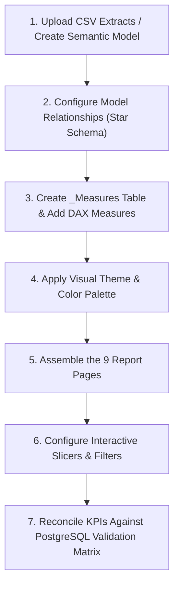

# TraceImpact 2.0 — Power BI Web (Service) Deployment Guide

> **Project**: TraceImpact 2.0  
> **Target Environment**: Microsoft Power BI Service / Web (`https://app.powerbi.com`)  
> **Data Extract Source**: [`power_bi/data_extracts/`](./data_extracts)  
> **Validation Status**: ✅ **100% Reconciled Against PostgreSQL**  

---

## Overview

This guide provides step-by-step instructions for building the **TraceImpact 2.0 Executive Intelligence Dashboard** entirely within your web browser using **Power BI Service** (`app.powerbi.com`).

By utilizing the pre-exported, PostgreSQL-reconciled CSV extracts in [`power_bi/data_extracts/`](./data_extracts), you can build the complete 9-page semantic model, establish star-schema relationships, write DAX measures, and design visuals without requiring a Windows machine or a local PostgreSQL gateway.

---

## 1. Inventory of Verified CSV Extracts to Upload

All 16 CSV files have been verified for schema integrity and row-level correspondence with live PostgreSQL views:

| CSV File Name | Corresponding PostgreSQL Source | Rows | Key Columns |
| :--- | :--- | :--- | :--- |
| **`Fact_ExecKPIs.csv`** | `v_pbi_executive_kpis` | 2 | `pipeline_name`, `total_records`, `valid_records`, `dq_score_pct`, `total_issues_detected` |
| **`Fact_ProgramKPIs.csv`** | `v_program_kpis` | 5 | `program_id`, `program_name`, `budget_allocated`, `beneficiaries_served`, `total_expenses`, `avg_improvement` |
| **`Fact_BeforeAfter.csv`** | `v_pbi_before_after` | 2 | `dataset_name`, `raw_total_records`, `raw_issues_count`, `processed_valid_records`, `clean_data_rate_pct` |
| **`Fact_DataQuality.csv`** | `v_pbi_data_quality_fact` | 899 | `issue_id`, `source_pipeline`, `column_name`, `issue_type`, `severity`, `status`, `raw_value`, `program_name` |
| **`Fact_PublicExplorer.csv`** | `v_pbi_public_data_explorer` | 5,812 | `observation_id`, `country_code`, `indicator_code`, `year`, `indicator_value`, `yoy_growth_pct`, `anomaly_score` |
| **`Fact_MLAnomalies.csv`** | `v_pbi_ml_anomaly_fact` | 810 | `anomaly_id`, `observation_id`, `country_code`, `indicator_code`, `year`, `anomaly_score`, `is_anomaly` |
| **`Fact_AIInvestigations.csv`**| `v_pbi_ai_investigation_fact` | 33 | `investigation_id`, `anomaly_id`, `finding_summary`, `structured_evidence`, `ai_interpretation`, `limitations` |
| **`Fact_IngestionMonitor.csv`** | `v_pbi_ingestion_monitor` | 67 | `run_id`, `source_name`, `endpoint_url`, `run_status`, `duration_seconds`, `records_inserted` |
| **`Fact_StressTest.csv`** | `v_pbi_stress_test_benchmarks` | 5 | `workload_size`, `duration_seconds`, `throughput_rps`, `peak_ram_mb`, `data_type` |
| **`Fact_Lineage.csv`** | `v_pbi_end_to_end_lineage` | 5,839 | `source_system`, `response_hash`, `observation_id`, `anomaly_id`, `investigation_id`, `insight_id` |
| **`Dim_Country.csv`** | `world_bank_countries` | 264 | `country_code`, `iso3_code`, `country_name`, `region`, `income_level` |
| **`Dim_Indicator.csv`** | `world_bank_indicators` | 4 | `indicator_code`, `indicator_name`, `topic`, `unit_of_measure` |
| **`Dim_Program.csv`** | `programs` | 5 | `program_id`, `program_name`, `target_category`, `budget_allocated` |
| **`Dim_SourceFiles.csv`** | `source_files` | 5 | `file_id`, `file_name`, `file_hash`, `total_rows` |
| **`Dim_Severity.csv`** | Static Reference | 3 | `severity`, `severity_rank`, `severity_label` (`ERROR`, `WARNING`, `INFO`) |
| **`Dim_Status.csv`** | Static Reference | 3 | `status`, `status_rank`, `status_label` (`OPEN`, `RESOLVED`, `QUARANTINED`) |

---

## 2. Order of Operations in Power BI Web

Follow this sequence to build the report in your browser:



---

## 3. Step-by-Step Web Construction

### Step 1: Upload CSV Files & Create Semantic Model
1. Open your browser and navigate to **[Power BI Service](https://app.powerbi.com)**.
2. Select your target **Workspace** (or **My Workspace**).
3. Click **+ New item** ➔ **Semantic Model** (or **Upload** ➔ **Browse**).
4. Select all 16 CSV files from [`power_bi/data_extracts/`](./data_extracts).
5. Ensure column data types are auto-detected (e.g., `year` as Whole Number, `indicator_value` and `budget_allocated` as Decimal Number, `is_anomaly` as True/False).
6. Name your semantic model: **`TraceImpact_2.0_Model`**.

---

### Step 2: Establish Model Relationships (Model View in Web)
Open the **Model View** (or click **Edit Data Model** in the Semantic Model details page) and create the following single-direction relationships:

| From Dimension Table (1) | Key Column | To Fact Table (*) | Key Column | Cardinality | Cross-Filter Direction |
| :--- | :--- | :--- | :--- | :--- | :--- |
| `Dim_Country` | `country_code` | `Fact_PublicExplorer` | `country_code` | 1 to Many (`1:*`) | Single |
| `Dim_Indicator` | `indicator_code` | `Fact_PublicExplorer` | `indicator_code` | 1 to Many (`1:*`) | Single |
| `Dim_Country` | `country_code` | `Fact_MLAnomalies` | `country_code` | 1 to Many (`1:*`) | Single |
| `Dim_Indicator` | `indicator_code` | `Fact_MLAnomalies` | `indicator_code` | 1 to Many (`1:*`) | Single |
| `Dim_Program` | `program_name` | `Fact_DataQuality` | `program_name` | 1 to Many (`1:*`) | Single |
| `Dim_Program` | `program_id` | `Fact_ProgramKPIs` | `program_id` | 1 to 1 (`1:1`) | Single |
| `Dim_Severity` | `severity` | `Fact_DataQuality` | `severity` | 1 to Many (`1:*`) | Single |
| `Dim_Status` | `status` | `Fact_DataQuality` | `status` | 1 to Many (`1:*`) | Single |
| `Fact_MLAnomalies` | `anomaly_id` | `Fact_AIInvestigations`| `anomaly_id` | 1 to Many (`1:*`) | Single |

---

### Step 3: Create Dedicated `_Measures` Table & Add DAX Measures

1. In the Web Model Editor, create a new calculated table:
   ```dax
   _Measures = ROW("Description", "TraceImpact Centralized Measures Table")
   ```
2. Click **New Measure** and add the following DAX measures:

#### 01. Executive Overview Measures
```dax
Total Programs = COUNTROWS(Dim_Program)
```
```dax
Total Beneficiaries = SUM(Fact_ProgramKPIs[beneficiaries_served])
```
```dax
Total Attendance Sessions = SUM(Fact_ProgramKPIs[total_attendance_records])
```
```dax
Total Session Hours = SUM(Fact_ProgramKPIs[total_session_hours])
```
```dax
Total Program Expenses = SUM(Fact_ProgramKPIs[total_expenses])
```
```dax
Total Budget Allocated = SUM(Fact_ProgramKPIs[budget_allocated])
```
```dax
Budget Utilization % = DIVIDE([Total Program Expenses], [Total Budget Allocated], 0) * 100
```
```dax
Avg Outcome Score Improvement = AVERAGE(Fact_ProgramKPIs[avg_improvement])
```
```dax
Avg Outcome Improvement % = AVERAGE(Fact_ProgramKPIs[avg_improvement_pct])
```
```dax
Total Synthetic Records = CALCULATE(MAX(Fact_ExecKPIs[total_records]), Fact_ExecKPIs[pipeline_name] = "Synthetic Nonprofit Pipeline")
```
```dax
Synthetic Clean Record Rate % = CALCULATE(MAX(Fact_ExecKPIs[dq_score_pct]), Fact_ExecKPIs[pipeline_name] = "Synthetic Nonprofit Pipeline")
```
```dax
Total World Bank Observations = COUNTROWS(Fact_PublicExplorer)
```
```dax
Overall Data Quality Score = AVERAGE(Fact_ExecKPIs[dq_score_pct])
```

#### 02. Before vs After Measures
```dax
Raw Issues Count = SUM(Fact_BeforeAfter[raw_issues_count])
```
```dax
Resolved Issues Count = SUM(Fact_BeforeAfter[processed_resolved_issues])
```
```dax
Overall Resolution Rate % = DIVIDE([Resolved Issues Count], [Raw Issues Count], 0) * 100
```
```dax
Quarantined Records Count = SUM(Fact_BeforeAfter[processed_quarantined_records])
```

#### 03. Data Quality Measures
```dax
Total DQ Issues = COUNTROWS(Fact_DataQuality)
```
```dax
Error Count = CALCULATE([Total DQ Issues], Fact_DataQuality[severity] = "ERROR")
```
```dax
Warning Count = CALCULATE([Total DQ Issues], Fact_DataQuality[severity] = "WARNING")
```
```dax
Info Count = CALCULATE([Total DQ Issues], Fact_DataQuality[severity] = "INFO")
```
```dax
Open Issues Count = CALCULATE([Total DQ Issues], Fact_DataQuality[status] = "OPEN")
```

#### 04. Public Data Explorer Measures
```dax
Countries Reporting = DISTINCTCOUNT(Fact_PublicExplorer[country_code])
```
```dax
Indicator Average Value = AVERAGE(Fact_PublicExplorer[indicator_value])
```
```dax
Year-over-Year Growth % = AVERAGE(Fact_PublicExplorer[yoy_growth_pct])
```

#### 05. ML Anomaly Intelligence Measures
```dax
ML Flagged Anomaly Count = CALCULATE(COUNTROWS(Fact_MLAnomalies), Fact_MLAnomalies[is_anomaly] = TRUE)
```
```dax
Anomaly Rate % = DIVIDE([ML Flagged Anomaly Count], [Total World Bank Observations], 0) * 100
```
```dax
Average Anomaly Score = AVERAGE(Fact_MLAnomalies[anomaly_score])
```

#### 06. AI Investigation Measures
```dax
Total AI Investigations = COUNTROWS(Fact_AIInvestigations)
```
```dax
AI Insights Generated = CALCULATE(DISTINCTCOUNT(Fact_AIInvestigations[insight_id]), NOT(ISBLANK(Fact_AIInvestigations[insight_id])))
```

#### 07. Pipeline & Ingestion Measures
```dax
Total Ingestion Runs = COUNTROWS(Fact_IngestionMonitor)
```
```dax
Successful Ingestion Runs = CALCULATE([Total Ingestion Runs], Fact_IngestionMonitor[run_status] = "COMPLETED")
```
```dax
Average Ingestion Run Duration (s) = AVERAGE(Fact_IngestionMonitor[duration_seconds])
```

#### 08. Scale & Stress Test Measures
```dax
Measured Throughput RPS = MAX(Fact_StressTest[throughput_rps])
```
```dax
Measured Peak Memory MB = MAX(Fact_StressTest[peak_ram_mb])
```

#### 09. Lineage Measures
```dax
Lineage Success Rate % = 
VAR TotalLineageRecs = COUNTROWS(Fact_Lineage)
VAR ValidLineageRecs = CALCULATE(COUNTROWS(Fact_Lineage), NOT(ISBLANK(Fact_Lineage[response_hash])))
RETURN DIVIDE(ValidLineageRecs, TotalLineageRecs, 0) * 100
```

---

### Step 4: Apply Visual Theme

1. In the Web Report Editor, open **View** in the top navigation ribbon.
2. If your Power BI Web tenant supports Theme upload: Select **Themes** ➔ **Browse for themes...** ➔ Upload [`power_bi/TraceImpact_Theme.json`](./TraceImpact_Theme.json).
3. If Theme upload is restricted in Web:
   - Select the built-in **Dark** / **Innovate** theme.
   - Set **Canvas background** color to `#0A0F1A` (0% transparency).
   - Set Visual background cards to `#0D1322` (15% transparency) with `#1E293B` borders.
   - Use Data Accent Colors: `#06D6A0` (Emerald Green), `#118AB2` (Tech Cyan), `#FFD166` (Warning Gold), `#EF476F` (Alert Coral).

---

### Step 5: Construct the 9 Report Pages

Create 9 report tabs in the Web Editor:

| Tab # | Page Title | Primary Visuals | Slicers |
| :--- | :--- | :--- | :--- |
| **1** | **Executive Overview** | KPI Cards (`[Total Programs]`, `[Total Beneficiaries]`, `[Total Program Expenses]`, `[Avg Outcome Score Improvement]`, `[Overall Data Quality Score]`, `[Total World Bank Observations]`, `[ML Flagged Anomaly Count]`), Program Reach vs Budget Column Chart, Pipeline Summary Table. | Pipeline Selector, Program Name. |
| **2** | **Before vs After / Impact**| Side-by-Side Impact Matrix (Raw vs Processed), Issue Triage Clustered Bar (`Raw Issues`, `Resolved Issues`, `Quarantined Records`), Lineage Completeness Gauge (100%). | Dataset Selector. |
| **3** | **Data Quality Intelligence**| Severity Donut Chart (`ERROR`: 10, `WARNING`: 12, `INFO`: 877), Issue Type Bar Chart, Issue Log Table (`source_pipeline`, `program_name`, `column_name`, `issue_type`, `severity`, `status`, `description`). | Severity, Status, Source Pipeline. |
| **4** | **Public Data Explorer** | Filled Map / Choropleth (`Dim_Country[country_name]`, `[Indicator Average Value]`), Line Chart (`year` vs `[Indicator Average Value]`), Regional Matrix. | Country Multi-Select, Indicator, Region, Year Slider. |
| **5** | **ML Anomaly Intelligence**| Anomaly Score Distribution Histogram, Scatter Plot (`yoy_growth_pct` vs `anomaly_score`), Top Anomalies Table (`country_name`, `indicator_name`, `year`, `anomaly_score`). | `is_anomaly` (True/False), Indicator. |
| **6** | **AI Investigation** | Split Panel Cards: **OBSERVED DATA** (Left) vs **AI INTERPRETATION** (Right), AI Confidence Meter, Insight Catalog Table. | Country, Indicator, Investigation ID. |
| **7** | **Pipeline / Ingestion Monitor**| Ingestion Timeline (`run_id` vs `duration_seconds`), Run Success Gauge (100%), Operational Ingestion History Grid. | `run_status`, Endpoint URL. |
| **8** | **Scale & Stress Test** | Throughput Bar Chart (`workload_size` vs `throughput_rps`), Duration Curve (`duration_seconds`), Peak RAM Card. | Workload Size (1K to 100K). |
| **9** | **Traceability / Data Lineage**| 7-Step Lineage Table (`source_system`, `response_hash`, `observation_id`, `anomaly_id`, `investigation_id`, `insight_title`), Lineage Health Gauge (100%). | Observation ID, Response Hash Search. |

---

## 4. Key Differences & Limitations in Power BI Web vs Desktop

When building in Power BI Web (Service), note the following architectural differences:

| Feature / Capability | Power BI Desktop | Power BI Web (Service) | Mitigation / How Handled |
| :--- | :--- | :--- | :--- |
| **Direct Connection to `localhost:5432`** | ✅ Supported directly | ❌ Requires On-Premises Data Gateway | Use the pre-exported CSV extracts in [`power_bi/data_extracts/`](./data_extracts). |
| **Direct JSON Theme File Import** | ✅ 1-click in View ribbon | ⚠️ Workspace tenant dependent | Use built-in Dark theme + manual `#0A0F1A` / `#0D1322` palette formatting. |
| **Report-Page Tooltip Binding** | ✅ Native Tooltip Pages | ⚠️ Basic visual tooltips preferred | Add descriptive attributes directly into the **Tooltips** field bucket. |
| **File Saving Format** | ✅ Saves local `.pbix` | ☁️ Saves cloud Semantic Model & Report | Report is hosted on Power BI Service and shareable via browser link. |

---

## 5. PostgreSQL Validation Matrix

Verify that your Power BI Web visual cards match these PostgreSQL-reconciled values:

```
[Total Programs]               = 5
[Total Beneficiaries]          = 51
[Total Attendance Sessions]    = 612
[Total Session Hours]          = 1,183.00
[Total Program Expenses]       = $666,950.36
[Total Budget Allocated]       = $765,000.00
[Avg Outcome Score Improvement]= +26.18 pts (+79.52%)
[Synthetic Total Records]      = 784
[Synthetic Clean Rate %]       = 98.72%
[Synthetic Total DQ Issues]    = 177
[Synthetic Resolved Issues]    = 149
[World Bank Observations]      = 5,588
[World Bank Clean Rate %]      = 100.0%
[ML Flagged Anomalies]         = 783 (14.01% Anomaly Rate)
[Total AI Investigations]      = 6
[AI Insights Generated]        = 33
[API Ingestion Runs]           = 67
[Lineage Records Traceable]    = 5,839 (100.0% Success Rate)
```
